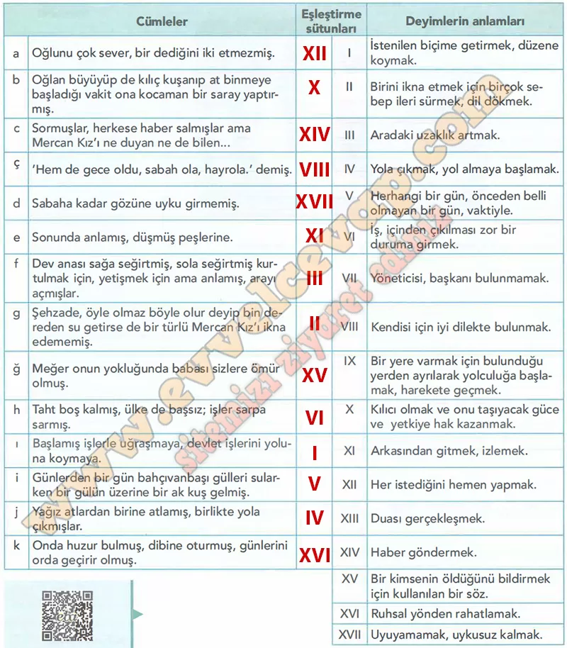

## 10. Sınıf Türk Dili ve Edebiyatı Ders Kitabı Cevapları Meb Yayınları Sayfa 64

**Soru: Aşağıda Mercan Kız masalında deyimlerin kullanıldığı bazı cümleler ve bu deyimlerin anlamlan verilmiştir. Cümlelerde geçen deyimlerin altını çizerek anlamlarıyla eşleştiriniz. Yaptığınız eşleştirmenin doğru olup olmadığım tablonun altındaki karekoddan kontrol ediniz.**

**Soru: 1) Deyimleri oluşturan kelimelerin yerine eş anlamlılarının kullanılıp kullanılamayacağı hakkındaki fikirleriniz nelerdir?**

* **Cevap**: Deyimlerdeki kelimeler genellikle değiştirilemez, çünkü anlam bozulur. Eş anlamlısı kullanıldığında deyimin etkisi ve kalıplaşmış yapısı kaybolur.

**Soru: 2) Dilimizin önemli söz varlıklarından olan deyimlerin günlük yaşamda ve sözlü kültür ürünlerinde sıklıkla yer almasının sebepleri neler olabilir?**

* **Cevap**: Deyimler kısa ve etkili anlatım sağlar. Duygu ve düşünceleri güçlü ifade eder, kültürümüzü yansıtır. Bu yüzden hem günlük yaşamda hem de sözlü kültür ürünlerinde sıkça kullanılır.

**10. Sınıf Meb Yayınları Türk Dili ve Edebiyatı Ders Kitabı Sayfa 64**