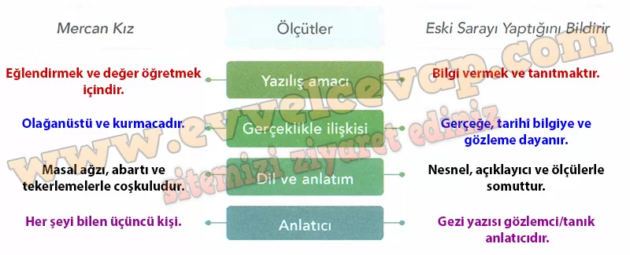

## 10. Sınıf Türk Dili ve Edebiyatı Ders Kitabı Cevapları Meb Yayınları Sayfa 67

**Soru: 1) Mercan Kız adlı masalla aşağıdaki gezi yazısını verilen ölçütlere göre karşılaştırınız.**

**ESKİ SARAYI YAPTIĞINI BİLDİRİR**

Eski Saray’ın hayat suyunun anlatılması: Fatih Sultan Mehmed zevk sahibi şanlı bir padişah olduğundan, “Aya İstanbul’un kangı suyu lâtifdir” diye bütün hekimlerini toplayıp sordular.

Onlar da Eski Saray içinde olan Şemun suyunu hepsinden hafif ve mutedil hazmı kolay bir hayat suyu buldular.

Bundan başka pınarların saf sularını beşer miskal olmak üzere pamuklar ile beraber tartıp ölçülü pamuklara tartılmış hafif su koyup anılan pamuklar beşer miskal suları çeker.

Daha sonra pamukları ateş saçan güneşte kurutup bütün pamuğu tartıp bu Şemun pınarında ıslanan pamuk bütün pamuklardan hafif geldiğinden hekimlerin sözüyle gayet hafif su olduğundan Fatih Sultan Mehmed daima o güze! sudan içerdi.

Hâlen bütün padişahlar ondan içerler ki kilârcıbaşı tarafından ve dış sakabaşı tarafından üçer adam her gün 6 kişi üçer seyishane yükü yirmişer okka (1 okka 1283 gr) gelir gümüş güğümlere o tatlı sudan ağzına kadar doldurup su nazırı huzurunda kilârcıbaşının güvenilir adamlarının mührüyle kırmızı balmumları ile güğümlerin ağızlarını mühürleyip padişaha her an götürürler.

Hâlâ o hayat çeşmesi Eski Saray’ın doğuya bakan kapısı önündedir ki Fatih Sultan Mehmed Han, Eski Saray’dan dışarı akıttırıp bu hayat pınarını yapmıştır.

**Soru: 2) Yaptığınız karşılaştırmadan faydalanarak edebî ve öğretici metinlerin genel özellikleriyle ilgili çıkarımlarınızı yazınız.**

* **Cevap**: Edebî metinler hayal gücüne dayanır, duygu ve estetik yönü ağır basar. Öğretici metinler ise gerçeğe dayalıdır, bilgi vermeyi ve açıklamayı amaçlar.

**10. Sınıf Meb Yayınları Türk Dili ve Edebiyatı Ders Kitabı Sayfa 67**