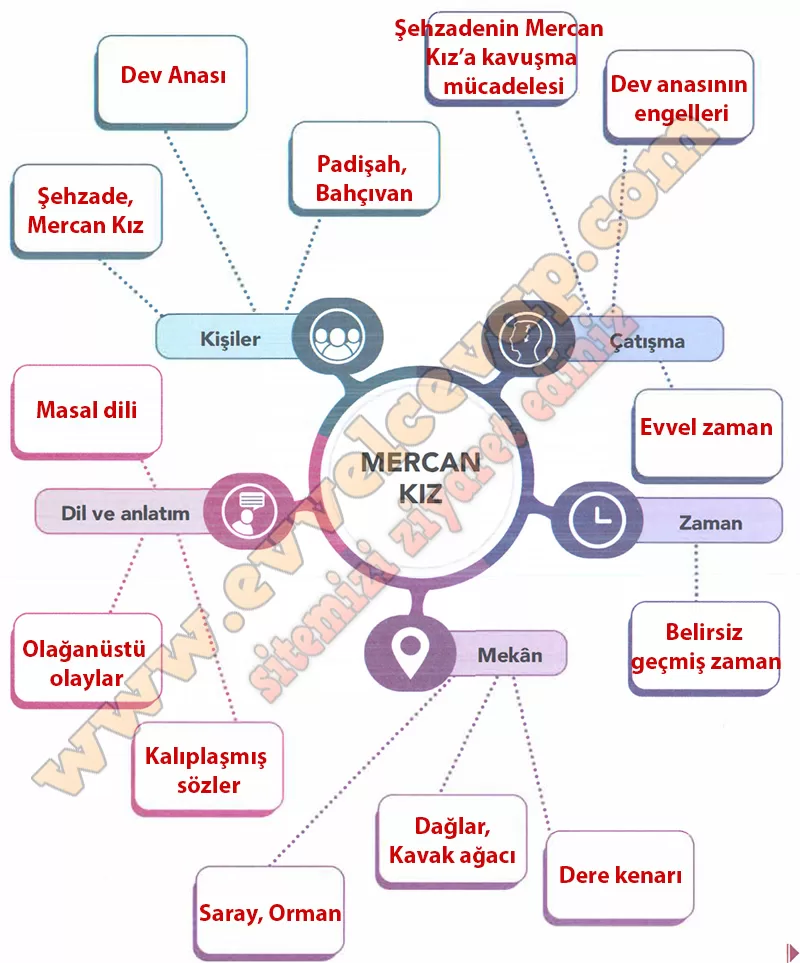

## 10. Sınıf Türk Dili ve Edebiyatı Ders Kitabı Cevapları Meb Yayınları Sayfa 70

**Birlikte Öğrenelim**

**Soru: Aşağıdaki zihin haritasında boş bırakılan kutucuklara uygun kelimeleri yazınız.**

**10. Sınıf Meb Yayınları Türk Dili ve Edebiyatı Ders Kitabı Sayfa 70**