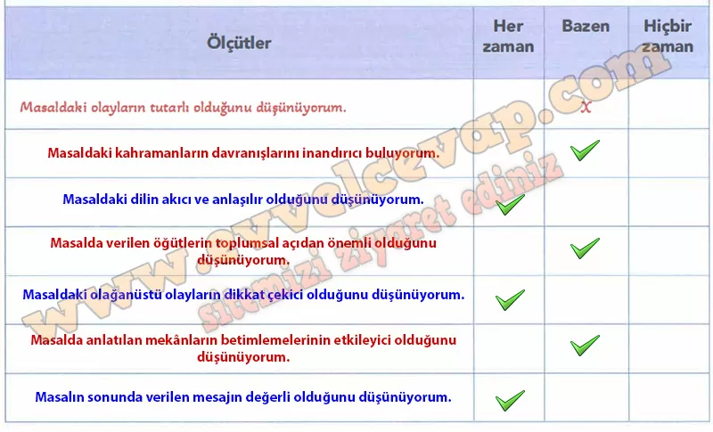

## 10. Sınıf Türk Dili ve Edebiyatı Ders Kitabı Cevapları Meb Yayınları Sayfa 72

**Soru: b) Şehzade, size göre hangi değeri/değerleri temsil etmektedir?**

* **Cevap**: O, cesaret, azim ve doğruluğu temsil eder.

**Soru: c) Bu değerin/değerlerin sizin hayatınızdaki önemine örnekler veriniz.**

* **Cevap**: Cesaretle zor işlere girişirim, azimle ders çalışınca hedefime ulaşırım.

**Soru: 3. Mercan Kız’ın ve şehzadenin temsil ettiği değerlerin toplumsal yaşamdaki önemine dair görüşlerinizi örneklerle açıklayınız.**

* **Cevap**: Mercan Kız’ın sadakati ve şehzadenin cesareti toplumda güven ve dayanışmayı güçlendirir. İnsanlar sabırlı ve cesur olursa zorluklar aşılır, toplum daha güçlü olur.

**Soru: Bu form, kendi beğeni ölçütlerinizi belirleyerek Mercan Kız masalını değerlendirebilmeniz için oluşturulmuştur. Çalışmanızı en doğru yansıtan ölçüt cümlesini yazarak karşısındaki derecelerden en uygun olduğunu düşündüğünüz seçeneği “X” ile işaretleyiniz. “Hiçbir zaman” ve “Bazen” seçeneklerini işaretlediyseniz bu davranışlarınıza yönelik eksiklerinizi gözden geçiriniz.**

**10. Sınıf Meb Yayınları Türk Dili ve Edebiyatı Ders Kitabı Sayfa 72**