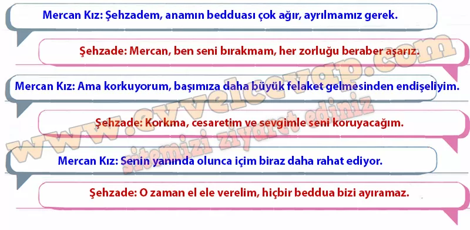

## 10. Sınıf Türk Dili ve Edebiyatı Ders Kitabı Cevapları Meb Yayınları Sayfa 74

**Sıra sizde**

**Soru: Aşağıda Mercan Kız masalından bir parça verilmiştir. Bu parçayı okuyunuz ve yönergeleri takip ederek çalışmayı yapınız.**

Dev anası gelmiş. Seslenmiş, seslenmiş, yok. Bir gün, iki gün, tam üç gün beklemiş de eve girememiş. Sonunda anlamış, düşmüş peşlerine. Düşmesiyle birlikte iki üç adımda yetişmiş onlara.  
 Mercan Kız dönmüş ki anası arkalarında. Heybesinden hemen bir testi suyu çıkarmış, yere vurmuş. Vurmasıyla aralarında gürül gürül akan bir ırmak oluşmuş. Dev anası sağa seğirtmiş, sola seğirtmiş kurtulmak için, yetişmek için; ama anlamış, arayı açmışlar. Yetişemeyeceğini anlayınca arkalarından bağırmış:  
 — İlahi çocuklar! Benden kurtuldunuz ama alınyazınızdan kurtulamazsınız. Yedi yıl hasretlik çekip de kavuşamayasınız, diye beddua etmiş ve dönmüş arkasını gitmiş.  
 Bizimkiler derelerden sel gibi, tepelerden yel gibi konarak göçerek bir derenin kenarına gelmişler. Kavak ağacının altında Mercan Kız:  
 — Dinlenelim biraz, demiş.  
 İnmişler atlarından. Mercan Kız:  
 — Şehzadem, anam çok kötü beddua etti. İlerde zor bir zamanda tutacağına gel biz bugün burda ayrılalım. Ben bu kavak ağacının tepesinde seni bekleyeyim. Bak saray göründü zaten. Sen de git sarayına. Altı ay sonra gelir, beni burdan alırsın.  
 Şehzade:  
 — Öyle olmaz böyle olur, deyip bin dereden su getirse de bir türlü Mercan Kız’ı ikna edememiş.  
 Mercan Kız çıkmış kavak ağacının tepesine. Şehzade de varmış gitmiş saraya.

**Soru: Mercan Kız’ın “ilerde zor bir zamanda tutacağına gel biz bugün burda ayrılalım. Ben bu kavak ağacının tepesinde seni bekleyeyim.” önerisine kendinizi şehzadenin yerine koyarak cevap veriniz.**

**Soru: Verdiğiniz cevaba göre Mercan Kız ve şehzadenin karşılıklı konuşmalarından oluşan bir metin yazınız.**

**Soru: Yazdığınız metni arkadaşlarınızla paylaşınız.**

* **Cevap**: Metni arkadaşlarınızla paylaşabilirsiniz.

**10. Sınıf Meb Yayınları Türk Dili ve Edebiyatı Ders Kitabı Sayfa 74**