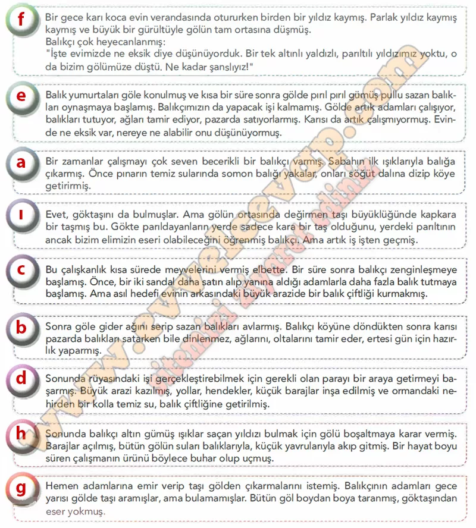

## 10. Sınıf Türk Dili ve Edebiyatı Ders Kitabı Cevapları Meb Yayınları Sayfa 75

**Soru: 1) Aşağıda bir masal metni bölümlere ayrılarak karışık biçimde verilmiştir. Bu parçaları anlamlı bir bütün oluşturacak şekilde harflendirerek sıralayınız.**

**10. Sınıf Meb Yayınları Türk Dili ve Edebiyatı Ders Kitabı Sayfa 75**