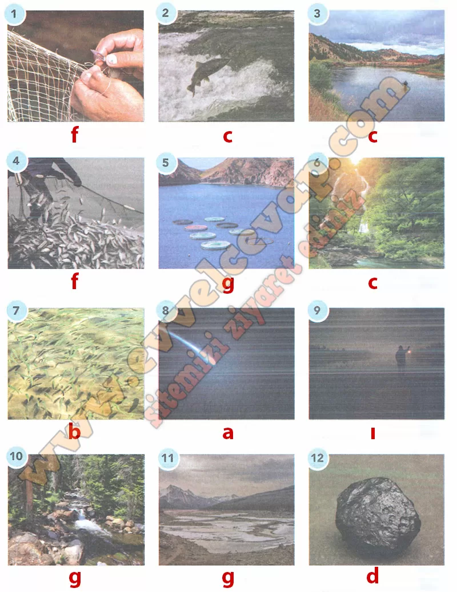

## 10. Sınıf Türk Dili ve Edebiyatı Ders Kitabı Cevapları Meb Yayınları Sayfa 76

**Soru: 2) Masalın her parçası için bir görsel kullanmanız istenseydi aşağıdaki görselleri hangi parçalar için kullanırdınız? Görsellerin altlarındaki boşluklara parçaların başındaki harfleri yazınız (Bir parça için birden fazla görsel seçebilirsiniz.).**

**10. Sınıf Meb Yayınları Türk Dili ve Edebiyatı Ders Kitabı Sayfa 76**