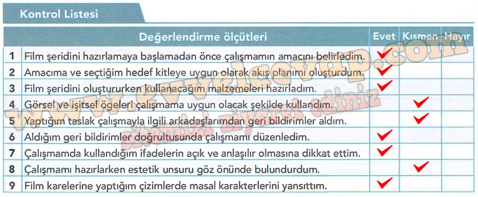

## 10. Sınıf Türk Dili ve Edebiyatı Ders Kitabı Cevapları Meb Yayınları Sayfa 78

**Soru: Aşağıdaki Kontrol Listesi’nde verilen Ölçütlere göre çalışmanızı değerlendiriniz.**

**Soru: Değerlendirme sonunda “Hayır” ya da “Kısmen” ile işaretlediğiniz ölçütleri bir kez daha gözden geçiriniz ve eksiklerinizi tamamlayınız.**

* **Cevap**: Kısmen olanlar için ses efektleri ve müzik ekleyeceğim, görselleri daha özenli çizeceğim. Daha çok kişiden geri bildirim alıp kare geçişlerini netleştireceğim.

**Soru: Aşağıdaki form, arkadaşınızın çalışmasını değerlendirmeniz için hazırlanmıştır. Bu formdaki sorulara vereceğiniz cevaplarla arkadaşınızın çalışmasına katkı sağlamanız beklenmektedir.**

**Soru: Bu değerlendirmelerden elde ettiğiniz sonuçlar doğrultusunda çalışmanıza son şeklini veriniz.**

* **Cevap**: Görselleri renklendirip ayrıntı ekledim, geçiş okları ve kapak/kapanış kareleri koydum; metinleri kısaltıp ses/müzik ekledim, yazım-noktalama kontrolü yaptım.

**Soru: Çalışmanızı sınıf/okul panosu veya okulun resmî çevrim içi ortamlarında paylaşınız.**

* **Cevap**: Çalışmayı PDF/PNG olarak hazırlayıp sınıf panosuna asacağım; okulun resmî çevrim içi ortamında “Mercan Kız – Film Şeridi” başlığıyla paylaşacağım.

**Soru: Dijital ortamlarda eserinize yönelik karşılaşabileceğiniz olumsuz eleştirileri anlayışla karşılayarak bunlara nezaket kuralları çerçevesinde cevap veriniz.**

* **Cevap**: Olumsuz eleştiriler için “geri bildiriminiz için teşekkürler” diyerek anlayışla yaklaşacağım; yapıcı olanları düzeltecek, nezaketsiz olanlara kısa ve saygılı yanıt verip tartışmayı büyütmeyeceğim.

**10. Sınıf Meb Yayınları Türk Dili ve Edebiyatı Ders Kitabı Sayfa 78**