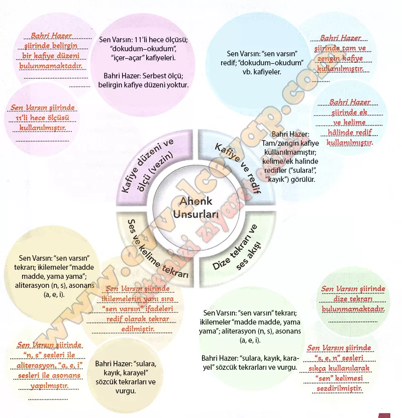

## 10. Sınıf Türk Dili ve Edebiyatı Ders Kitabı Cevapları Meb Yayınları Sayfa 90

**Sıra Sizde**

**Soru: Aşağıdaki şiirleri okuyunuz ve şiirlerle ilgili çalışmaları yapınız.**

**SEN VARSIN**

Gönül tezgahımda şiir dokudum,  
 İplik iplik nakışında sen varsın.  
 Aşk yolunun kanununu okudum,  
 Madde madde yokuşunda sen varsın.

Fikir vadisinden bir ırmak geçer,

Eğilir serviler suyundan içer. ..

Bağrında ay doğar, zambaklar açar;  
 Sessiz sessiz akışında sen varsın.

Öz-suyusun hayat denen şişenin;  
 Nedenisin keder ile neşenin  
 Sevda cephesinde şehit düşenin  
 Donuk donuk bakışında sen varsın.

Hep senin renginde görünür bahar;  
 Yaprakta yeşilin, gülde kokun var,  
 Yama yama kalbimdeki yaralar;  
 Sıra sıra dikişinde sen varsın.

Gidip de yorulma çok uzaklara,  
 Sen-seni gel benim içimde ara …  
 Umut güneşimin mor bulutlara  
 Girip girip çıkışında sen varsın.

**BAHRİ HAZER**

Ve Türkmen kayıkçı  
 dümenin yanına bağdaş kurup oturmuş.  
 ( . . . )  
 Bakmıyor  
 kayığa  
 sarılan  
 sulara!  
 Bakmıyor  
 ( . . . )  
 çatlayıp  
 yarılan  
 sulara!  
 – Yaman esiyor be karayel yaman!  
 Sakın özünü Hazerin hilesinden aman!  
 Aman oyun oynamasın sana rüzgar!  
 – Aldırma anam ne çıkar?  
 Ne çıkar  
 kudurtsun  
 karayel  
 suları,  
 Hazerde doğanın  
 Hazerdir mezarı!  
 Çıkıyor kayık  
 iniyor kayık  
 çıkıyor ka …  
 iniyor ka …  
 Çık .. .  
 in .. .  
 çık …

**Soru: 1) Sen Varsın ve Bahri Hazer şiirlerinde hangi ritim unsurlarına yer verilmiştir? Metinlerden örneklerle açıklayınız.**

* **Cevap**: **Sen Varsın** şiirinde ritim, ölçü, kafiye ve rediflerle sağlanmıştır. Örneğin, “sen varsın” ifadesi her dizede tekrar edilerek ahenk oluşturmuştur. **Bahri Hazer** şiirinde ise ritim sözcük tekrarları, dizelerin kırılarak verilmesi ve ses benzerlikleriyle sağlanmıştır. Örneğin, “çıkıyor kayık / iniyor kayık” ve “çık… in… çık…” ifadeleri ritmi güçlendirmiştir.

**Soru: 2) Sayfa 91 ’de verilen kavram haritasında Sen Varsın ve Bahri Hazer şiirlerindeki ahenk unsurlarıyla ilgili boş bırakılan yerleri tamamlayınız.**

**10. Sınıf Meb Yayınları Türk Dili ve Edebiyatı Ders Kitabı Sayfa 90**