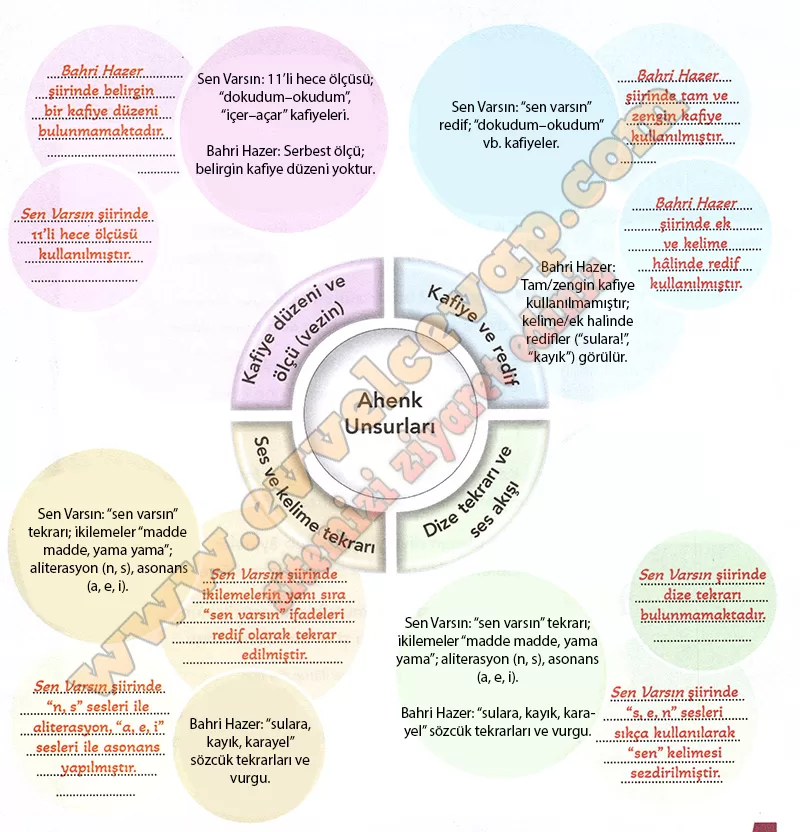

## 10. Sınıf Türk Dili ve Edebiyatı Ders Kitabı Cevapları Meb Yayınları Sayfa 91

**Sıra Sizde**

**Soru: Sayfa 92’deki gazeli göz gezdirerek okuma yöntemiyle okuyunuz. Başlık ve görselden hareketle şiirin içeriğine yönelik tahminlerde bulununuz.**

* **Cevap**: Başlıktan ve görselden, şiirin divan edebiyatı geleneğine ait bir gazel olduğunu, aşk, sevgili, hasret ve dönüp dolaşan duygular üzerine yazıldığını tahmin ediyorum.

**Soru: Sayfa 92’de okuyacağınız gazeli anlamak ve anlamlandırmak için gazelin günümüz Türkçesiyle yazılmış şeklini güvenilir kaynaklardan bularak arkadaşlarınızla paylaşınız.**

* **Cevap**: Gazelin günümüz Türkçesiyle yazılmış hâlinde sevgilinin güzelliği, âşığın ona olan özlemi ve aşk uğruna çekilen sıkıntılar dile getirilmektedir. Şair, sevgilinin zülüflerini, yüzünü ve bakışlarını överek duygularını ifade etmektedir. (Günümüz Türkçesi sınıfta arkadaşlarla paylaşılabilir.)

**Soru: Şiir, öğretmen tarafından ritmine dikkat edilerek bir kez okunur. Sonrasında ise birkaç gönüllü öğrenciye sesli olarak okutulur.**

* **Cevap**: Şiir öğretmen tarafından ritmine dikkat edilerek okunduğunda, ahenk ve musikî duygusu hissedilir. Öğrenciler sesli okuduğunda ise gazelin melodik yapısı ve tekrar eden “döne döne” redifi daha etkili şekilde anlaşılır.

**10. Sınıf Meb Yayınları Türk Dili ve Edebiyatı Ders Kitabı Sayfa 91**