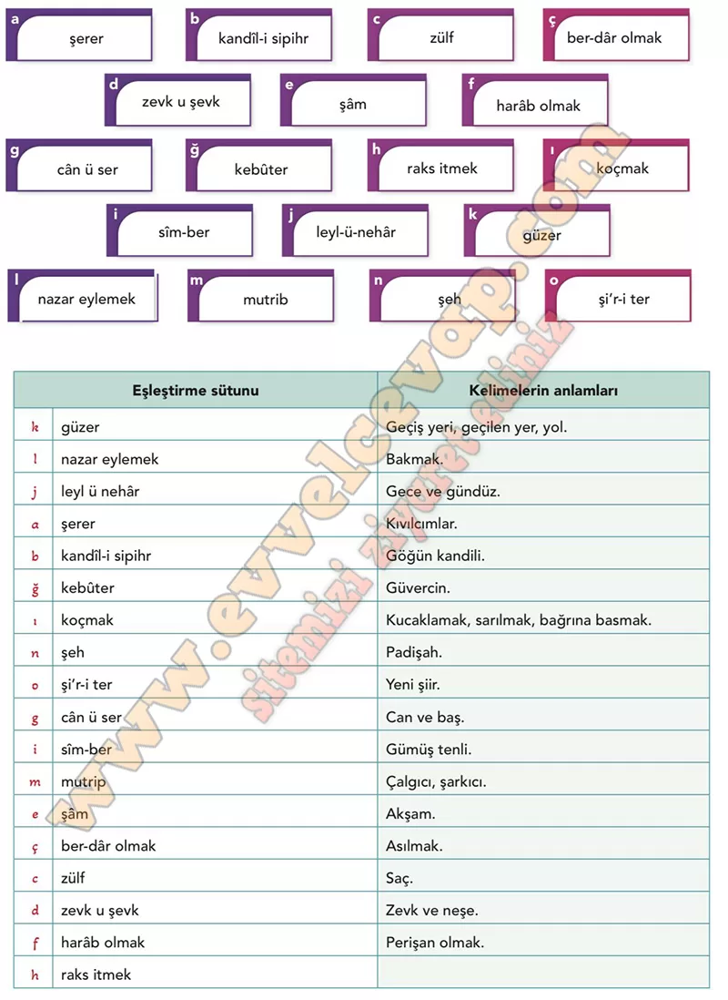

## 10. Sınıf Türk Dili ve Edebiyatı Ders Kitabı Cevapları Meb Yayınları Sayfa 93

**Söz Varlığım**

**Soru: Gazelde geçen bazı kelime ve kelime gruplan ile bunların anlamlan aşağıda verilmiştir. Dizelerdeki bağlamından hareketle bu kelime ve kelime grupları anlamlarıyla eşleştiriniz. Yaptığınız eşleştirmenin doğru olup olmadığını tablonun yanındaki karekoddan kontrol ediniz.**

**10. Sınıf Meb Yayınları Türk Dili ve Edebiyatı Ders Kitabı Sayfa 93**