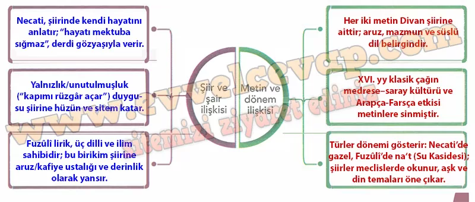

## 10. Sınıf Türk Dili ve Edebiyatı Ders Kitabı Cevapları Meb Yayınları Sayfa 97

**Sıra Sizde**

**Soru: Aşağıdaki metinlerden faydalanarak infografıkte boş bırakılan yerleri tamamlayınız.**

**NECATI BEY’IN KENDİSİ**

Necati Bey gerçek yaşam öyküsüne, kişisel özelliklerine ve psikolojisine dair şu bilgileri bizimle paylaşır.  
 Hayatı Roman  
 Sevgiliye hitaben yazıldığı hissini uyandıran şu beyitte Necati’nin gerçek hayatından izler taşıdığını görürüz. Yaşadığı çok şey vardır. Derdini ancak gözyaşıyla anlatabilir. Şairin hayatı mektuplara sığmaz, yazılsa roman olur:  
 Nâmeye sığmaz Necâtînün oransuz kıssası  
 Göz yaşıyla kapuna ‘arz ola bakî mâ-cerâ  
 O kadar yalnız, kimsesiz ve unutulmuştur ki evinin kapısını rüzgârdan başka açan bulunmaz:  
 Bir veçhe unuduldı Necâtîki kimsene Mihnet-serâsı kapusın açmaz meğer ki bâd

**FUZULI’NIN EDEBİ KİŞİLİĞİ VE ŞAİRLİĞİ**

Fuzûlî, yaşadığı XVI. yüzyıldan bugüne kadar yetişen, Türk edebiyatının tanınmış şairleri içerisinde en büyük lirik şair olarak şiir tahtında oturmaktadır. Doğuştan şair yaratılmış olan bu müstesna kabiliyet Türk, Arap ve İran kültürlerinin tabakalaştığı Irak-ı Arab’da Arapçayı, Farsçayı ve devrinin bütün ilimlerini hakkıyla öğrenmiştir. Eserlerinden tefsir, hadis, kelâm, fıkıh, mantık, hendese, astronomi ve tıp ilimlerini bildiği anlaşılmaktadır. Bu sebeple kaynaklar ondan ”Mevlânâ Fuzûlî” diye bahsetmişlerdir. Fuzûlî’yi gördüğü anlaşılan hemşehrisi Ahdî, onun âlim, fâzıl, iyi yaratılışlı, sohbeti tatlı bir insan olduğunu, üç dille şiir yazdığını, aruz ve kafiye ilminde ve muamma söylemekte usta olduğunu, nesrinin sanatlı, secili, fakat akıcı olup herkes tarafından beğenildiğini yazmıştır. (…)

**10. Sınıf Meb Yayınları Türk Dili ve Edebiyatı Ders Kitabı Sayfa 97**