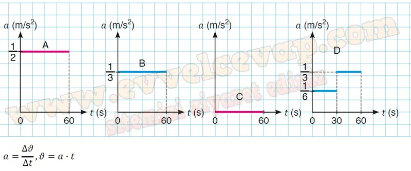
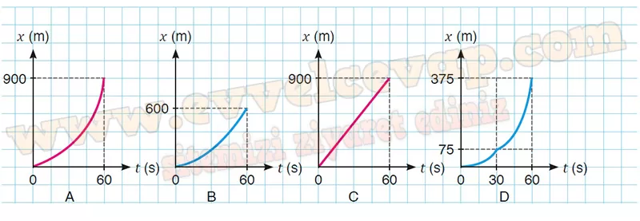

## 10. Sınıf Fizik Ders Kitabı Cevapları Meb Yayınları Sayfa 103

**Soru: 8) Bir otoyolun gişelerinden geçerken = 0 anında yan yana olan A, B, C ve D araçlarının ilk 60 s’deki grafikleri verilmektedir. Buna göre;**

**Soru: a) Araçların ν-t grafiklerini inceleyerek 30. s’deki hızlarını hesaplayınız.**

* **Cevap**: VA = 15 m/s, VB = 10 m/s, Vc = 15 m/s, VD = 5 m/s

**Soru: b) Araçların ν-t grafiklerinden yararlanarak a-t grafiklerini çiziniz. İvme ve hız kavramlarına ait matematiksel modelleri yazınız.**

**Soru: c) Araçların (0-60) s aralığındaki yer değiştirme büyüklüklerini hesaplayarak hangi araçların tekrar yan yana konumlarda bulunabileceğini yazınız.**

𝑥A = 900 m, 𝑥B = 600 m, 𝑥C = 900 m, 𝑥D = 375 m  
 A ve C araçları yan yana olur.

**Soru: ç) Araçların ν-t grafiklerinden yararlanarak x-t grafiklerini çiziniz.**

**10. Sınıf Meb Yayınları Fizik Ders Kitabı Sayfa 103**