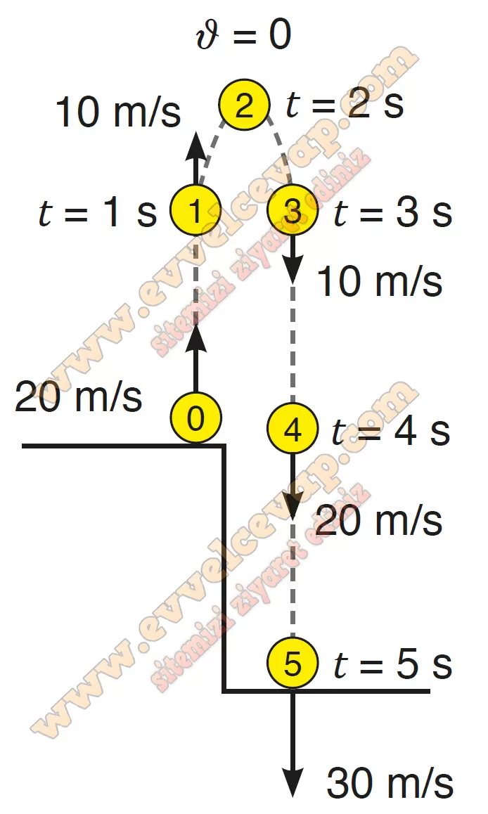

## 10. Sınıf Fizik Ders Kitabı Cevapları Meb Yayınları Sayfa 104

**Soru: d) Dört araç için çizdiğiniz a-t ve x-t grafikleri ile harekete ait matematiksel modeller arasındaki ilişkiyi kendi cümleleriniz ile yazınız.**

• V-t grafiklerinde grafik doğrusu ile yatay eksen arasında kalan alan yer değiştirme büyüklüğünü verir. Bu alan yer değiştirmenin matematiksel modeline eşittir.  
 • a-t grafiklerinde grafik doğrusu ile yatay eksen arasında kalan alan hareketlinin hız değişiminin büyüklüğünü verir. Bu alan hız değişimi büyüklüğünün matematiksel modeline eşittir.  
 • Sabit ivmeli harekette hız arttığı için x-t grafiği parabolik eğri olur.

**Soru: 9) Bir taş uçurumun kenarından yukarıya doğru 20 m/s hız büyüklüğü ile fırlatılmaktadır. Taş 5 s sonra uçurumun tabanına çarpmaktadır. Yandaki şekil, taşın her 1 s’lik aralıklarla bulunduğu konumları göstermektedir. Buna göre;**

**Soru: a) Taşın hareketi ile ilişkili aşağıdaki durumların her birinde ivmenin yönünü yukarı, aşağı veya sıfır olup olmamasına göre belirtiniz.**

✅Taş yukarı doğru çıkarken ivmenin yönü **aşağı doğru** olur.  
 ✅Taş aşağı doğru inerken ivmenin yönü **aşağı doğru** olur.  
 ✅Taş en üst noktada iken ivmenin yönü **aşağı doğru** olur.

**Soru: b) Taşın şekilde verilen 1, 2, 3, 4 ve 5 numaralı noktalardaki hızının yönünü ve büyüklüklerini aşağıda bulunan boş alana şekli yeniden çizerek şekil üzerinde gösteriniz.**

**10. Sınıf Meb Yayınları Fizik Ders Kitabı Sayfa 104**