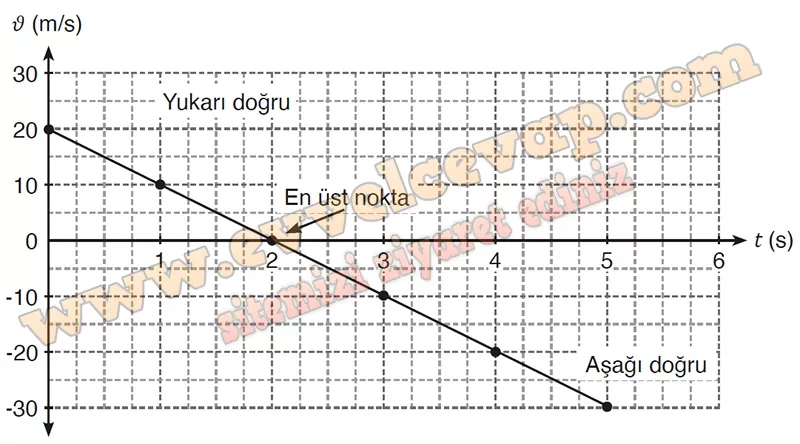

## 10. Sınıf Fizik Ders Kitabı Cevapları Meb Yayınları Sayfa 105

**Soru: c) Taşın hareketine ait d-t grafiğini çiziniz. Serbest düşme hareketi bağlamında taşın yukarı ve aşağı yönünü temsil eden bölgelerini ve hareketin en üst noktasını grafik üzerinde belirtiniz.**

**Soru: ç) Çizdiğiniz grafiğin eğimi fizik bilimine ait hangi kavramı ifade eder?**

* **Cevap**: Çizilen grafiğin eğimi taşın ivmesini ifade eder.

**Soru: d) Uçurumun yüksekliğini (h) verilere göre hesaplayınız. Farklı kütleye sahip olan bir cismin farklı hızla atılması durumunda uçurumun yüksekliğini alma süresi nasıl değişir? Açıklayınız.**

Taşın atıldığı noktadan geçerken ki konumu ile çarptığı zemin arasındaki yer değiştirme uçurumun yüksekliğini verir.  
 h = −25 m bulunur.  
 Taş atıldığı yüksekliğe daha hızlı gelirse taşın uçurumun yüksekliğini alma süresi azalır. Bu durumun tersi de doğrudur. Geçen süre kütleden bağımsızdır.

**10. Sınıf Meb Yayınları Fizik Ders Kitabı Sayfa 105**