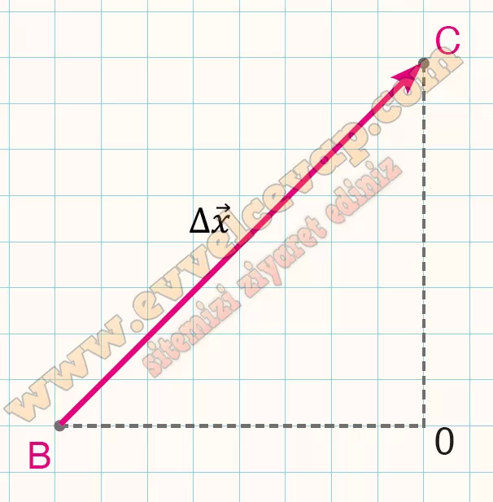

## 10. Sınıf Fizik Ders Kitabı Cevapları Meb Yayınları Sayfa 15

**Ön Değerlendirme**

Robot süpürgeler; sensörleri sayesinde yörüngelerini belirleyen, halı ve parke gibi farklı zeminlerde çekiş gücünü ayarlayabilen, ev temizliğinde insanlara yardımcı olmak için tasarlanmış elektronik cihazlardır. Sensörler, önüne bir engel çıkan süpürgenin yavaşlayarak durmasını ve farklı bir yöne dönerek çalışmaya devam etmesini sağlar. Ayrıca sensörler, bekleme istasyonuna yaklaşan süpürgenin süratini azaltarak istasyona ulaştığında durmasını sağlar.

Şekilde bir evin krokisi verilmiştir. Süpürge, A noktasında durgun hâlde iken harekete başlayarak belirli bir sürate ulaşınca hareketine sabit süratle devam eder. Süpürge dönüş hareketi esnasında A noktasına yaklaştığında süratini azaltır ve A noktasına ulaştığında durur. Süpürge, şekilde kesikli çizgilerle gösterilen AOB, BOC ve COA yörüngelerini sırasıyla takip ederek başlangıç noktasına geri döner.

**Soru: 1) Süpürgenin hareketi boyunca hangi durumdaki yer değiştirme büyüklüğü en küçüktür?**

* **Cevap**: Süpürge, belirlenen yolları takip ederek başladığı noktaya geri dönmektedir. Süpürgenin hareketi boyunca A’dan B noktasına, O’dan C noktasına gittiğinde belirli bir yer değiştirmesi varken başlangıç noktası olan A noktasına dönmesiyle yapmış olduğu yer değiştirme sıfır olur. Süpürge hareketi boyunca A noktasından başlayıp tekrar A noktasına döndüğünden süpürgenin yer değiştirmesi en küçük değeri alır.

**Soru: 2) Süpürgenin B ve C noktaları arasındaki yer değiştirmesini açıklayarak şekil üzerinde çizerek gösteriniz.**

* **Cevap**: Yer değiştirme, süpürgenin hareketinin başlangıç noktası (B) ile bitiş noktasını (C) birleştiren vektördür. Süpürgenin izlediği yolun şekli veya uzunluğu ne olursa olsun yer değiştirme her zaman sadece bu iki nokta arasındaki doğrusal uzaklığa eşittir.

**Soru: 3) Süpürgenin O’dan B’ye ve B’den Oya giderken sahip olduğu hız büyüklüklerini karşılaştırınız.**

* **Cevap**: Süpürgenin O’dan B’ye ve B’den O’ya giderken hız büyüklükleri eşittir.

**Soru: 4) Süpürgenin hareketinin hangi durumlarında sürati değişmiştir?**

* **Cevap**: Süpürgenin hareketinde süpürge başlangıçta hızlanırken, engellere çarptığında yavaşlarken ve yön değiştirirken süratinde değişimler gözlemlenir.

**10. Sınıf Meb Yayınları Fizik Ders Kitabı Sayfa 15**