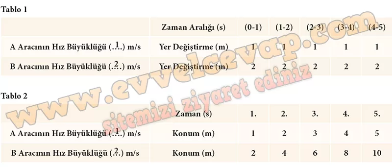
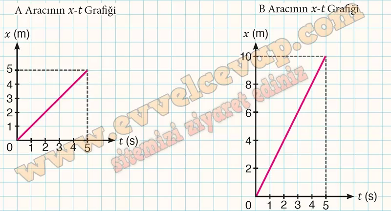
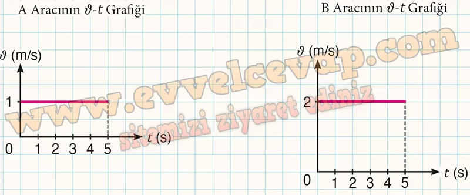

## 10. Sınıf Fizik Ders Kitabı Cevapları Meb Yayınları Sayfa 17

**Soru: 4)** İlk ölçümlerinizi A aracı, ikinci ölçümlerinizi B aracı olarak değerlendirmek üzere simülasyonu çalıştırınız. Ekranda yer alan “Aracın hızı” göstergesi üzerindeki ayar düğmesini sağa doğru sürükleyerek A aracı için bir hız büyüklüğü seçiniz ve tabloya yazınız. Ekranda beliren “BAŞLAT” butonuna tıklayıp A aracının hareketini inceleyerek sistematik ölçümler yapınız. Yapmış olduğunuz ilk ölçümlere yönelik aracın zamana bağlı yer değiştirme büyüklüklerini Tablo l’deki ve konumlarını Tablo 2’deki ilgili bölümlere yazınız. Ardından ikinci ölçümlerinize başlamak üzere “SIFIRLA” butonuna tıklayınız. Ayar düğmesini sağa doğru sürükleyerek B aracı için A aracından farklı bir hız büyüklüğü seçiniz ve simülasyonu tekrarlayınız. B aracının hız büyüklüğü, yer değiştirme ve konum bilgilerini tablolardaki ilgili bölümlere yazınız. **Tüm adımları özenle uygulayarak süreci dikkatle takip ediniz ve bu süreçte karşılaşabileceğiniz sorunlar karşısında kararlı bir tutum sergileyiniz.**

**Soru: 5) Tablo 2’deki verilerden yararlanarak araçların x-t (konum-zaman) grafiklerini ilgili alana çiziniz.**

**Soru: 6) A ve B araçları için belirlediğiniz hız büyüklüklerini kullanarak araçların û-t (hız-zaman) grafiklerini ilgili alana çiziniz.**

**10. Sınıf Meb Yayınları Fizik Ders Kitabı Sayfa 17**