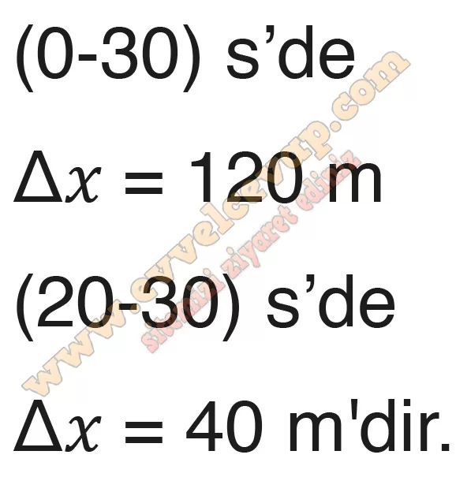
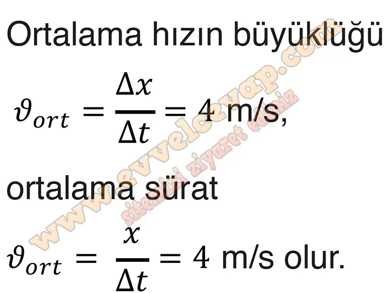

## 10. Sınıf Fizik Ders Kitabı Cevapları Meb Yayınları Sayfa 23

**1.2 Soru**

**Soru: Antrenman yapan bir buz pateni sporcusu yatay doğrultuda hareket etmektedir. Sporcuya ait x-t grafiği şekildeki gibi olduğuna göre;**

**Soru: a) Sporcunun (0-30) s ve (20-30) s zaman aralıklarındaki hareketi boyunca yapmış olduğu yer değiştirme büyüklüklerini bulunuz.**

**Soru: b) Grafikten yararlanarak sporcunun ortalama hızının büyüklüğünü, ortalama süratini matematiksel modelden yararlanarak bulunuz.**

**10. Sınıf Meb Yayınları Fizik Ders Kitabı Sayfa 23**