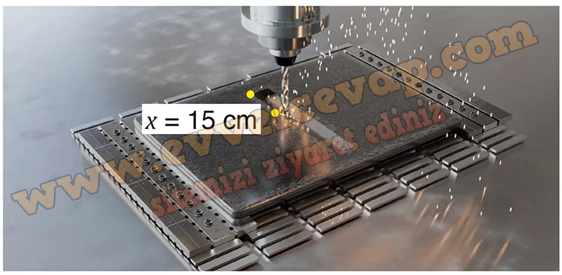
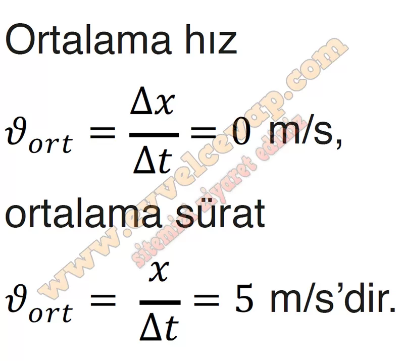
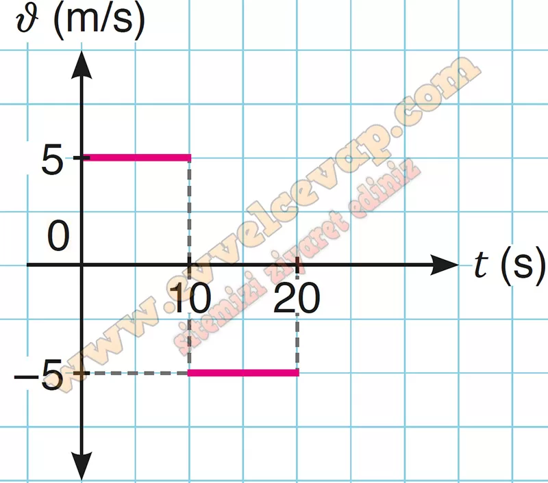

## 10. Sınıf Fizik Ders Kitabı Cevapları Meb Yayınları Sayfa 24

**1.3 Soru**

**Soru: Günümüzde mobilya ve metal işleme gibi birçok endüstride kullanılan CNC [Computer numerical control/kompitır numerikıl kontrol (bilgisayarlı sayısal kontrol)] makineleri; malzemeleri yüksek hassasiyetle kesmek, şekillendirmek ve işlemek için kullanılmaktadır. Görseldeki gibi “I” harfini çizmek için CNC makinesi A noktasından B noktasına harekete başlayarak 5 cm/s sabit hız büyüklüğü ile çalışacak şekilde programlanmıştır. “I” harfi tamamlandığında kola ait x-t grafiği şekildeki gibi olmaktadır. Buna göre CNC kesim makinesinin;**

**Soru: a) x-t grafiğini yorumlayınız.**

* **Cevap**: x-t grafiğine göre CNC makinesi A noktasından başlayarak 10 s’de B noktasına gitmiş ve geri dönerek 20. s’de tekrar A noktasına gelmiştir.

**Soru: b) 3 s sonra bulunduğu konumu I harfi üzerinde çizerek gösteriniz.**

**Soru: c) Hareketi boyunca ortalama hızının büyüklüğünü ve ortalama süratini hesaplayınız.**

**Soru: ç) x-t grafiğinden yararlanarak ν-t grafiğini çiziniz.**

**10. Sınıf Meb Yayınları Fizik Ders Kitabı Sayfa 24**