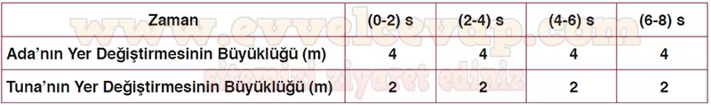
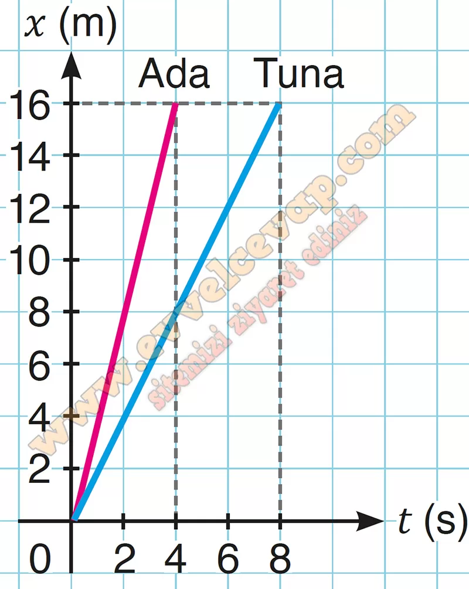
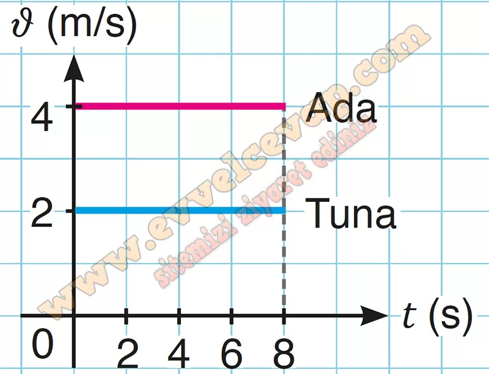

## 10. Sınıf Fizik Ders Kitabı Cevapları Meb Yayınları Sayfa 25

**1.4 Soru**

**Soru: Yapılacak bir etkinlik için hazırlanan doğrusal parkur 2 m’lik bölümlere ayrılarak işaretlenmiştir. Ada ve Tuna parkurun başlangıç noktasından (x = 0) scooterları ile sabit hızla geçerek parkurda işaretlenen noktalardan geçiş sürelerini kronometre ile ölçmüştür. Bu ölçüme göre Tuna her 2 m aralığı 1 s’de, Ada ise her 8 m aralığı 2 s’de geçmiştir. Buna göre**

**Soru: a) Ada ve Tuna’dan hangisinin daha hızlı olduğunu tahmin ederek yazınız.**

* **Cevap**: Ada daha hızlıdır.

**Soru: b) Ada ile Tuna’nın yer değiştirme büyüklüklerini ilk 8 s’deki zaman aralıklarına göre hesaplayarak aşağıda verilen tabloya yazınız.**

**Soru: c) Tablodan yararlanarak Ada ile Tuna’nın 8 s’lik hareketine ait x-t grafiklerini çiziniz,**

**Soru: ç) Tablodan yararlanarak Ada ile Tuna’nın 8 s’lik hareketine ait û-t grafiklerini çiziniz.**

**10. Sınıf Meb Yayınları Fizik Ders Kitabı Sayfa 25**