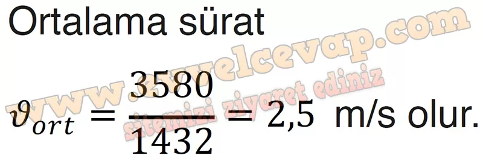
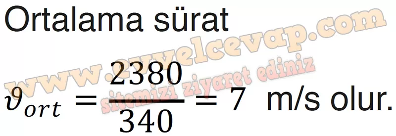

## 10. Sınıf Fizik Ders Kitabı Cevapları Meb Yayınları Sayfa 26

**1.5 Soru**

**Soru: Mete; her sabah evinden çıkıp otobüs durağına yürür, ardından otobüse binerek okula gider. Aşağıdaki haritada otobüs durakları kırmızı nokta ile Mete’nin evi ve okulunun yolu siyah çizgi ile, okul ve ev arasındaki kuş uçuşu uzaklık kırmızı çizgi ile gösterilmiştir. Mete’nin yolculuğu sırasında aldığı yollar ve zaman bilgileri tabloda verilmiştir. Buna göre Mete’nin;**

**Soru: a) Hareketi boyunca aldığı toplam yol kaç m olur?**

**Soru: b) Hareketi süresince sahip olduğu ortalama hızının hesaplanabilmesi için fizik bilimine ait hangi nicelikler bilinmelidir?**

* **Cevap**: Yer değiştirme ve zaman

**Soru: c) Evi ile okulu arasında sahip olduğu ortalama sürati bulunuz.**

**Soru: ç) Otobüse bindiği ve otobüsten indiği duraklar arasında otobüsün ortalama sürati nedir? Hesaplayınız.**

**10. Sınıf Meb Yayınları Fizik Ders Kitabı Sayfa 26**