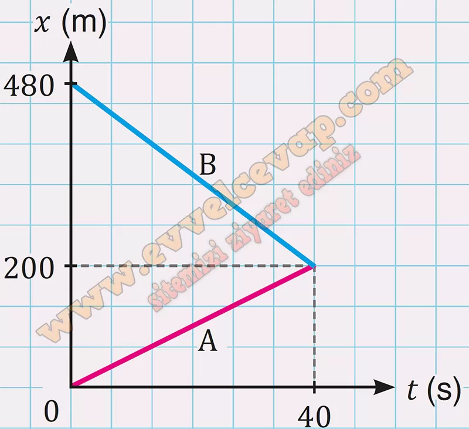

## 10. Sınıf Fizik Ders Kitabı Cevapları Meb Yayınları Sayfa 29

**Çalışma Yaprağı**

**Soru: Aşağıda verilen soruları yönergelerine göre cevaplayınız.**

**Soru: 1) Ayla ve Burak scooterları ile yatay doğrultuda aynı anda birbirlerine doğru harekete başlamaktadır. K ve L noktaları arasındaki mesafe 480 m’dir. Ayla K noktasından 5 m/s hızla, Burak L noktasından 7 m/s hızla geçerek şekildeki gibi ters yönde ilerlemektedir. Buna göre;**

**Soru: a) Ayla ve Burak kaç s sonra karşılaşır?**

**Soru: b) Ayla ve Burak’ın hareketinin x-t grafiğini karşılaşma anına kadar çiziniz.**

**Soru: 2) Bir koşu bandında sabit 3 m/s hız büyüklüğü ile koşan sporcu 120 s sonra bandın hız büyüklüğünü 6 m/s’ye çıkararak 120 s daha koşmuştur. Koşu bandının hareketinin grafiği şekilde verilmiştir. (Sporcunun koşu bandında aynı konumda olduğunu kabul ediniz.) Buna göre;**

**Soru: a) Koşu bandı üzerindeki bir noktanın (0-240) s aralığında aldığı yol kaç m’dir?**

**Soru: b) Sporcunun (120-240) s aralığındaki yer değiştirmesinin büyüklüğü kaç m’dir?**

**10. Sınıf Meb Yayınları Fizik Ders Kitabı Sayfa 29**