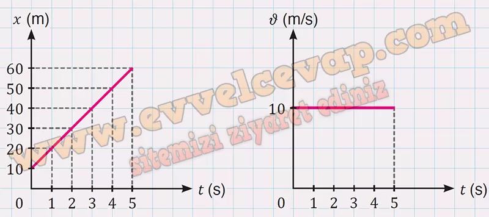

## 10. Sınıf Fizik Ders Kitabı Cevapları Meb Yayınları Sayfa 30

**Soru: 3) Yapılan bir çalışmada bir aracın yatay doğrultuda pozitif yöndeki \* ve t değerleri aşağıda yer alan tablodaki gibi tespit edilmiştir. Aracın başlangıç konumu 10 m olduğuna göre tablodaki verileri kullanarak**

**Soru: a) x-t ve ν-t grafiklerini çiziniz.**

**Soru: b) (2-5) s zaman aralığında aldığı yol kaç m olur?**

**Soru: c) x-t grafiğinde sabit hızla hareket eden bir aracın grafiği hangi özelliğe sahip olmalıdır?**

* **Cevap**: Sabit hızla hareket eden bir araç eşit zaman aralıklarında eşit yer değiştirmeler yaptığı için araca ait 𝑥-t grafiği, yatay doğrultu ile açı yapacak şekilde eğimli doğru olur.

**Soru: ç) Araç hareket durumunu değiştirmeden yoluna devam ettiğine göre aracın 6. s’deki konumunun kaç m olduğunu tahmin ediniz.**

**10. Sınıf Meb Yayınları Fizik Ders Kitabı Sayfa 30**