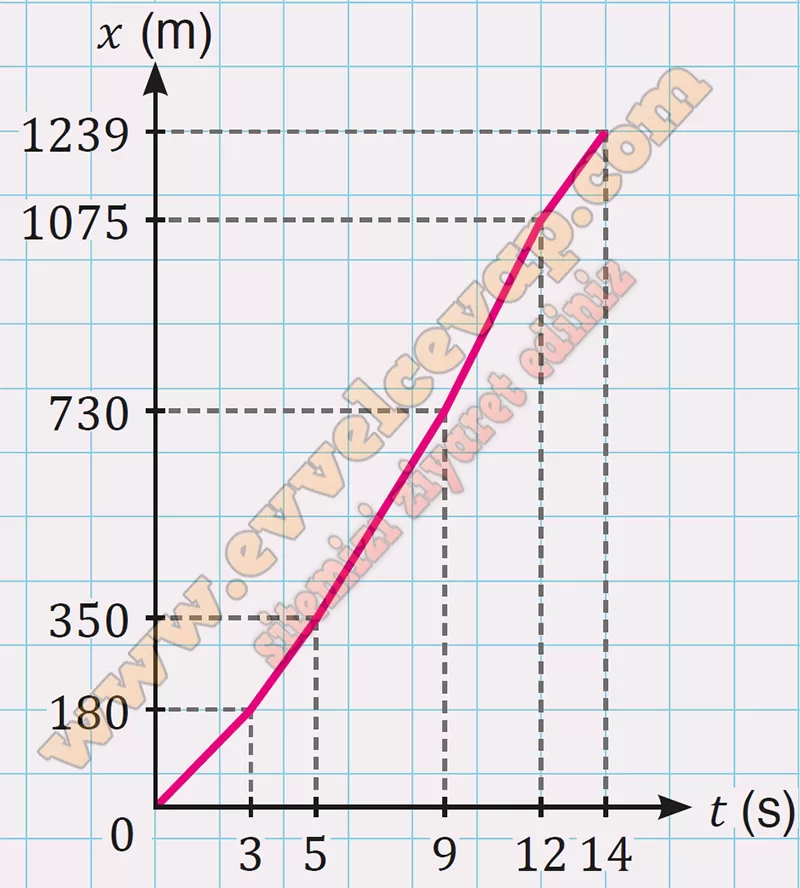

## 10. Sınıf Fizik Ders Kitabı Cevapları Meb Yayınları Sayfa 31

**Soru: 4)** Her bir balık türünün hız büyüklüğünü etkileyen çeşitli parametreler bulunmaktadır. Örneğin kılıç balığının hızı; suyun sıcaklığı ve balığın beslenme durumu, yaşı, boyutu, vücut sıcaklığı gibi birçok faktöre bağlıdır. Bir grup bilim insanı suyun sıcaklığına bağlı olarak kılıç balıklarının hız büyüklüğünün nasıl değiştiğini araştırmıştır. Araştırma sonuçlarına göre ortalama büyüklükteki bir kılıç balığının suyun sıcaklığına bağlı tahminî hız aralığı tablodaki gibidir. **Yatay doğrultuda hareket eden bir kılıç balığının zamana bağlı yer değiştirme verileri aşağıda verilmiştir. Buna göre;**

**Soru: a) Kılıç balığının (0-14) s aralığında yaptığı yer değiştirme büyüklüğünü ve aldığı yolu hesaplayınız.**

* **Cevap**: Yer değiştirmesi Δ𝑥 = 1239 m ve aldığı yol 𝑥 = 1239 m olur.

**Soru: b) Veri tablosundan yararlanarak kılıç balığının hareketine ait x-t grafiğini çiziniz.**

**Soru: c) Kılıç balığının (0-14) s arasındaki ortalama hız büyüklüğünü ve ortalama süratini bulunuz.**

**10. Sınıf Meb Yayınları Fizik Ders Kitabı Sayfa 31**