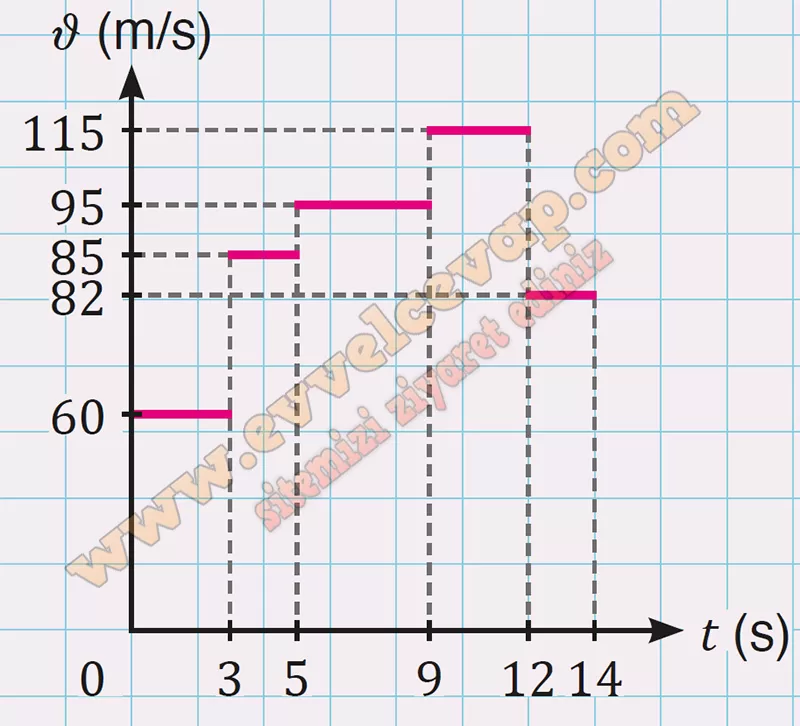

## 10. Sınıf Fizik Ders Kitabı Cevapları Meb Yayınları Sayfa 32

**Soru: ç) Kılıç balığına ait çizdiğiniz x-t grafiğinden yararlanarak ν-t grafiğini çiziniz.**

**Soru: d) Tabloda verilen zaman aralıklarına göre kılıç balığının hangi su sıcaklıklarında hareket ettiğini tahmin ediniz.**

**Soru: 5) Ali’nin doğrusal bir yol üzerinde bulunan evi ile okulunun arasındaki mesafe 600 m’dir. Ali’nin sabit hızla koşarak okula gitmesi 10 dk. ve okuldan eve sabit hızla yürüyerek dönmesi 20 dk. sürmektedir. Buna göre**

**Soru: a) Ali’nin evden okula ve okuldan eve giderken sahip olduğu hızlarının büyüklüğünü m/s cinsinden bulunuz.**

**Soru: b) Ali okula giderken ilk 3 dakikada kaç m yer değiştirmiştir?**

**10. Sınıf Meb Yayınları Fizik Ders Kitabı Sayfa 32**