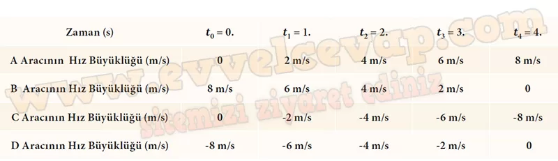
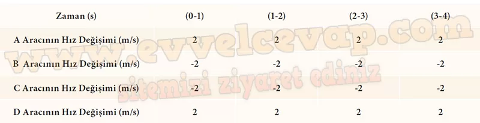

## 10. Sınıf Fizik Ders Kitabı Cevapları Meb Yayınları Sayfa 34

**Soru: Şekilde verilenlerden yararlanarak araçların hız büyüklüklerini tablodaki boşluklara yazınız.**

**Soru: 2) Tabloya yazdığınız verileri göz önünde bulundurarak A, B, C ve D araçlarının hız değişimlerini sınıf arkadaşlarınızla öğretmeninizin rehberliğinde tartışınız. Araçların hız değişimlerinin büyüklükleri ile ilgili elde ettiğiniz bilgileri kısaca yazınız.**

* **Cevap**: A aracının hızı zamanla pozitif yönde artarken B aracının hızı zamanla azalmaktadır. C ve D araçlarının her ikisi de negatif yönde hareket etmektedir. C aracının hızı zamanla negatif yönde artarken D aracının hızı zamanla azalmaktadır.

**Soru: 3) Tabloda verilen zaman aralıkları için A, B , C ve D araçlarının hız değişimi büyüklüklerini hesaplayarak aşağıda verilen tabloyu doldurunuz. Not: Hız değişimi, cismin son hızı ile ilk hızı arasındaki farktır. Hareketlinin hız değişimi Aı9 = ı9son ilk matematiksel modeliyle hesaplanır.**

**10. Sınıf Meb Yayınları Fizik Ders Kitabı Sayfa 34**