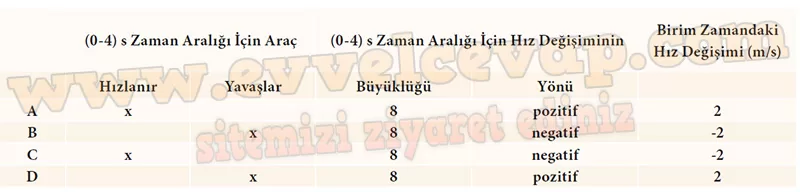

## 10. Sınıf Fizik Ders Kitabı Cevapları Meb Yayınları Sayfa 35

**Soru: 4) Elde ettiğiniz bilgilerden yararlanarak A, B, C ve D araçlarının (0-4) s aralığı için hareket durumunu (hızlanır ya da yavaşlar) tabloda “X” ile işaretleyerek belirtiniz. Araçların hız değişiminin büyüklüğünü (artar ya da azalır) ve yönünü (doğu ya da batı) tablodaki ilgili yerlere yazınız. Araçların (0-4) s ve birim zamandaki hız değişimlerini hesaplayınız ve tabloya yazınız.**

**Soru: 5) A ile C araçlarının hız değişimlerini karşılaştırarak ulaştığınız sonuçları aşağıdaki alana yazınız.**

* **Cevap**: A ve C araçlarının her ikisi de durgun hâlden harekete başlayıp zıt yönlerde hızlarını eşit sürede eşit miktar artırarak hızlanan hareket yapmıştır.

**Soru: 6) B ile D araçlarının hız değişimlerini karşılaştırarak ulaştığınız sonuçları aşağıdaki alana yazınız.**

* **Cevap**: B ve D araçlarının her ikisi de 8m/s büyüklüğünde hızlarla hareket ederken zıt yönlerde hızlarını eşit sürede eşit miktar azaltarak yavaşlayan hareket yapmıştır.

**Soru: 7) 4. basamaktaki tablodan yararlanarak ivme ve hız değişimi arasındaki ilişki için tahminlerde bulununuz. Arkadaşlarınızla tartışarak onların da fikirlerini alınız. Kendi fikirlerinizi elde ettiğiniz veriye dayalı olarak destekleyip arkadaşlarınızın farklı görüşlerini saygı çerçevesinde çürütmeye çalışınız.**

✅A aracı pozitif (+) yönde hızlanmış, B aracı pozitif (+) yönde yavaşlamıştır.  
 ✅C aracı negatif (-) yönde hızlanmış, D aracı negatif (-) yönde yavaşlamıştır.  
 ✅Durmakta iken harekete geçen, hareket hâlinde iken yavaşlayıp duran, yön değiştirip hızlanan veya yavaşlayan cisimlerin hareketi net kuvvetin etkisi ile bir ivmeye sahip olur. Bu durumda A, B, C ve D araçlarının da zamanla hızları değiştiğinden bu araçlar ivmeli hareket yapmıştır.

**Soru: 8) İvme ve hız değişimi arasındaki ilişkiyi genelleyiniz.**

✅A, B, C ve D araçlarının hızları zamanla değişiklik gösterdiğinden araçların hepsi ivmeli hareket yapar.  
 ✅A aracı pozitif yönde hızlanan hareket yapar. Bu durumda aracın hız değişimi ve ivmesi pozitif olur.  
 ✅B aracı pozitif yönde yavaşlayan hareket yapar. Bu durumda aracın hız değişimi ve ivmesi negatif olur.  
 ✅C aracı negatif yönde hızlanan hareket yapar. Bu durumda aracın hız değişimi ve ivmesi negatif olur.  
 ✅D aracı negatif yönde yavaşlayan hareket yapar. Bu durumda aracın hız değişimi ve ivmesi pozitif olur.

**Değerlendirme**

**Soru: 1) Sürücü frene bastığında aracın ivmesinde meydana gelen değişimi aracın hızı ile ilişkilendirerek açıklayınız.**

* **Cevap**: Fren pedalına basılan aracın hızı azalmaya başlayacağı için bu aracın ivmesi negatiftir.

**Soru: 2) Sürücü gaz pedalına bastığında aracın ivmesinin yönü ve büyüklüğü ne şekilde değişir? Açıklayınız.**

* **Cevap**: Gaz pedalına basılan aracın hızı artmaya başlayacağı için bu aracın ivmesi pozitiftir.

**Soru: 3) Sabit ivme ve hız değişimi arasındaki ilişkiyi günlük hayattan bir örnek vererek kendi cümlelerinizle açıklayınız.**

* **Cevap**: Örneğin bir istasyondan harekete başlayan tren, istenilen hız büyüklüğüne ulaşıncaya kadar hızlanır. Tren hızlanırken her bir zaman aralığındaki hız değişimi eşittir. Birim zamandaki hız değişimi sabit ise bu harekete sabit ivmeli hareket denir.

**10. Sınıf Meb Yayınları Fizik Ders Kitabı Sayfa 35**