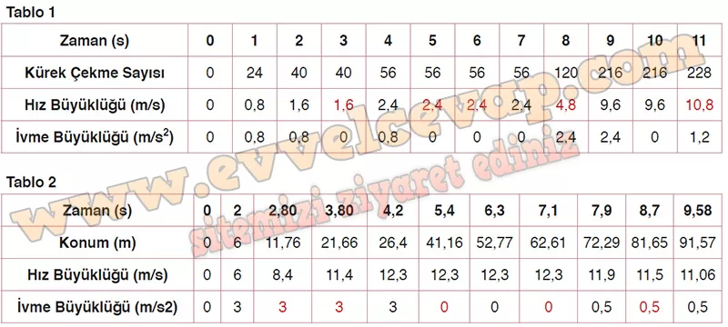

## 10. Sınıf Fizik Ders Kitabı Cevapları Meb Yayınları Sayfa 38

**1.7 Soru**

Kürek çekme, koşu gibi spor dallarında hız ve ivme, performansı belirleyen temel etmenlerdendir. Kürek çekme, sporcunun su direncine karşı kas gücünü kullandığı ve yüksek ivme kazanmayı hedeflediği bir dayanıklılık sporudur. Koşuda ise sporcunun hızını çok kısa sürede artırabilme kabiliyeti önemlidir.  
 Kürek sporcularının kürek tekniğini geliştirmesine ve hızlarını artırmasına, koşucuların ise maksimum hız performansı sağlamasına yardımcı olmak için yeni teknoloji ürünleri kullanılmaktadır. Bunlardan biri olan takip sistemleri dış mekân çalışmalarında sporcuların konum, hız, ivme, rota gibi bilgilerini toplar. Toplanan bilgiler sporcuların kendi performansını değerlendirebilmesini sağlar.  
 Aşağıda Tablo 1 ve Tablo’2 de sırasıyla kürek takımı ve koşu yapan sporcunun performanslarının ilk zamana ilişkin ivme ve hız büyüklükleri verilmiştir.

**Soru: Tablolarda verilen bilgileri inceleyerek aşağıdaki soruları cevaplayınız.**

**Soru: a) Kürek takımının hız ve koşucunun ivme büyüklerini belirleyiniz. Kürek takımına ait verileri Tablo 1 ’de, koşucuya ait verileri Tablo 2’de uygun yerlere yazınız.**

**Soru: b) Kürek takımının ve koşucunun hareketlerini, sabit hızlı ve sabit ivmeli hareket ile ilişkilendirin. Hız ve ivme değerlerini Tablo 1 ve Tablo 2’de yazarken bu değerleri seçme nedenlerinizi ve ilişkilendirdiğiniz hareket türlerini açıklayın.**

Kürek takımı ilk 2 s’de sabit ivmeli, (2-3) s aralığında sabit hızlı, (3-4) s aralığında sabit ivmeli, (4-7) s aralığında sabit hızlı, (7-9) s aralığında sabit ivmeli, (9-10) s aralığında sabit hızlı, (10-11) s aralığında sabit ivmeli hareket etmiştir. Takımın kürek çekme sayısı değişmediği için 3. s’deki hız büyüklüğü 1,6 m/s, 5 ve 6. s’lerdeki hız büyüklüğü 2,4 m/s olur. Takımın (7-9) s aralığında sabit ivmeli hareket etmesi ve ivme büyüklüğünün 2,4 m/s2 olması için 8. s’deki hız büyüklüğü 4,8 m/s olmalıdır. Takımın 11. s’deki ivme büyüklüğünün 1,2 m/s2 ve hız büyüklüğünün 10,8 m/s olması gerekir.

Koşucu (0-4,2) s aralığında sabit ivmeli, (4,2-7,1) s aralığında sabit hızlı, (7,1-9,58) s sabit ivmeli hareket etmiştir. (0-4,2) s aralığında sabit ivmeli hareket ettiği için koşucunun 2,80 ve 3,80. s’lerdeki ivme büyüklüğünün de 3 m/s2 olması gerekir. (4,2-7,1) s aralığında sabit hızlı hareket ettiği için koşucunun 5,4 ve 7,1. s’deki ivme büyüklüğü 0 olmalıdır. (7,1-9,58) s sabit ivmeli hareket ettiği için 7,9 ve 9,58. s’lerde olduğu gibi ivme büyüklüğünün 0,5 m/s2 olması gerekir.

**10. Sınıf Meb Yayınları Fizik Ders Kitabı Sayfa 38**