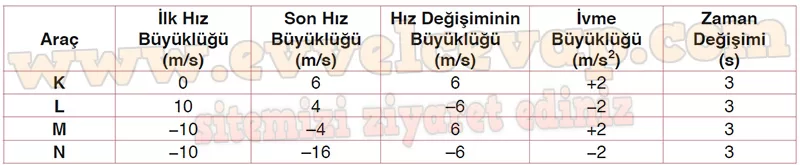

## 10. Sınıf Fizik Ders Kitabı Cevapları Meb Yayınları Sayfa 40

**1.9 Soru**

**Soru: Doğrusal bir yolda hareket eden K, L, M ve N araçlarının ilk hız ve ivme büyüklükleri aşağıdaki tabloda verilmiştir. Buna göre K, L, M ve N araçlarının;**

**Soru: a) 3. s’deki son hız büyüklüğünü ve (0-3) s zaman aralığındaki hız değişimlerinin büyüklüğünü tabloya yazınız.**

**Soru: b) Hız değişimleri ve ivme büyüklükleri arasındaki ilişkiyi yorumlayınız.**

* **Cevap**: Araçların hız değişiminin büyüklükleri, ivme büyüklükleri ile doğru orantılı ve aynı yönlüdür.

**10. Sınıf Meb Yayınları Fizik Ders Kitabı Sayfa 40**