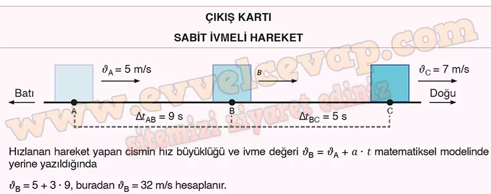
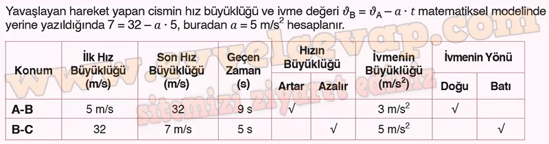

## 10. Sınıf Fizik Ders Kitabı Cevapları Meb Yayınları Sayfa 42

**Soru: Şekilde yatay doğrultuda hareket eden cismin A, B ve C konumlarından geçtiği andaki hızlarının büyüklüğü ve bu konumlar arasındaki hareket süresi gösterilmiştir. Cismin hız büyüklüğü A ve C noktalarından geçerken sırasıyla 5 m/s ve 7 m/s olmaktadır. Şekli inceleyerek ivme ve ivme yönü hakkındaki mevcut bilgilerinizden hareketle aşağıdaki soruları cevaplayınız, a ve b maddelerine verdiğiniz cevapları aşağıdaki tabloya yazınız.;**

**Soru: a) A konumundaki hızının büyüklüğü νA = 5 m/s olan cisim, 3 m/s2 olan ivme büyüklüğü ile 9 s boyunca düzgün hızlanmaktadır. Cismin B konumundaki νB hızının büyüklüğünü hesaplayarak tabloya yazınız ve cismin ivmesinin yönünü tabloya işaretleyiniz.**

**Soru: b) Cisim B ve C konumları arasında 5 s düzgün yavaşlamakta ve cismin hız büyüklüğü νa = 7 m/s’ye düşmektedir. Cismin bu konumlar arasındaki ivmesinin büyüklüğünü ve yönünü tabloda yer alan ilgili bölüme yazınız.**

**Soru: c) Sabit ivme ile hareket eden bir cismin hızı, ivmenin büyüklüğüne bağlı olarak ne şekilde değişebilir? İvme ile hız değişimi arasındaki ilişkiyi örneklerle açıklayınız.**

* **Cevap**: Büyük ivmelerde hız daha hızlı değişir, küçük ivmelerde hız yavaş değişir. Örneğin durgun hâldeki iki cisim aynı anda 2 m/s2 ve 5 m/s2 ivme ile harekete başlıyor. 10 s sonra sahip oldukları hız büyüklükleri Δc = 𝑎 ∙ t matematiksel modelinden 20 m/s ve 50 m/s hesaplanır.

**10. Sınıf Meb Yayınları Fizik Ders Kitabı Sayfa 42**