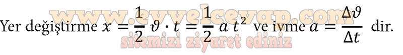

## 10. Sınıf Fizik Ders Kitabı Cevapları Meb Yayınları Sayfa 47

**Soru: 12) Çizdiğiniz ν-t grafiklerinden yararlanarak araçlara ait a-t grafiklerini ilgili alana çiziniz. Grafikleri karşılaştırarak yorumlayınız. Çizdiğiniz grafiklerin üzerine hangi araca ait olduğunu yazınız.**

* **Cevap**: Hızlanan araçların her birine ait hız-zaman ve ivme-zaman grafiklerinin aynı yönlü olması araçların hızlanarak hareket ettiğini gösterir. Yavaşlayan araçlardan A aracına ait hız-zaman grafiği pozitif kısımda yer alırken ivme-zaman grafiği negatif kısımda yer almıştır. Bunun sebebi, aracın pozitif yönde ilerlemesine rağmen hızının azalması ve ivmesinin negatif olmasıdır. Negatif yönde hareket eden B aracına ait hız-zaman grafiği negatif kısımda yer alırken ivme-zaman grafiği pozitif kısımda yer almıştır. Negatif yönde ilerleyen B aracının hızı azaldığı için hız farkı pozitiftir dolayısıyla aracın ivmesi de pozitif olur.

**Soru: 13) ν-t grafiğinden yararlanarak yer değiştirme ve ivme büyüklüklerine ait matematiksel modelleri yazınız.**

**Soru: 14) A ve B araçlarının hızlanma hareketi için çizdiğiniz grafiklerden yararlanarak araçların konumlarını Tablo 3 Te ilgili yerlere yazınız.**

**10. Sınıf Meb Yayınları Fizik Ders Kitabı Sayfa 47**