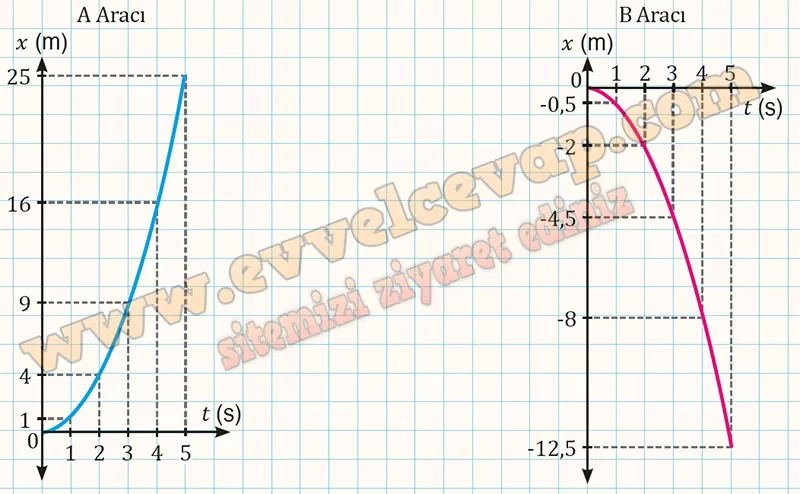
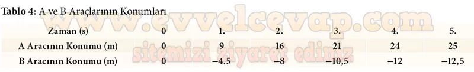

## 10. Sınıf Fizik Ders Kitabı Cevapları Meb Yayınları Sayfa 48

**Soru: 15) Tablo 3’teki bilgilerden yararlanarak zıt yönlerde hareket eden A ve B araçlarına ait x-t grafiklerini ilgili alana çiziniz. Grafikleri karşılaştırarak verilen alana yorumlarınızı yazınız.**

* **Cevap**: A ve B araçları hızlanan bir hareket yaptığından araçların birim zamandaki yer değiştirme büyüklükleri artarak devam etmektedir.

**Soru: 16) A ve B araçlarının yavaşlama hareketi için çizdiğiniz grafiklerden yararlanarak araçların konumlarını Tablo 4’te ilgili yerlere yazınız.**

**Soru: 17) Tablo 4’teki bilgilerden yararlanarak zıt yönlerde hareket eden A ve B araçlarına ait x-t grafiklerini ilgili alana çiziniz. Grafikleri karşılaştırarak verilen alana yorumlarınızı yazınız.**

**10. Sınıf Meb Yayınları Fizik Ders Kitabı Sayfa 48**