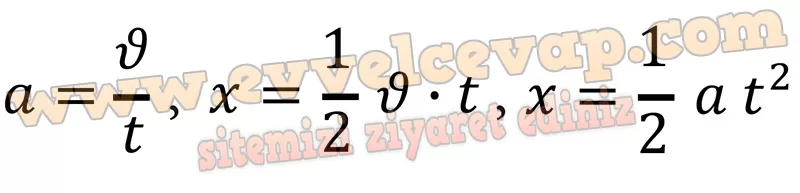
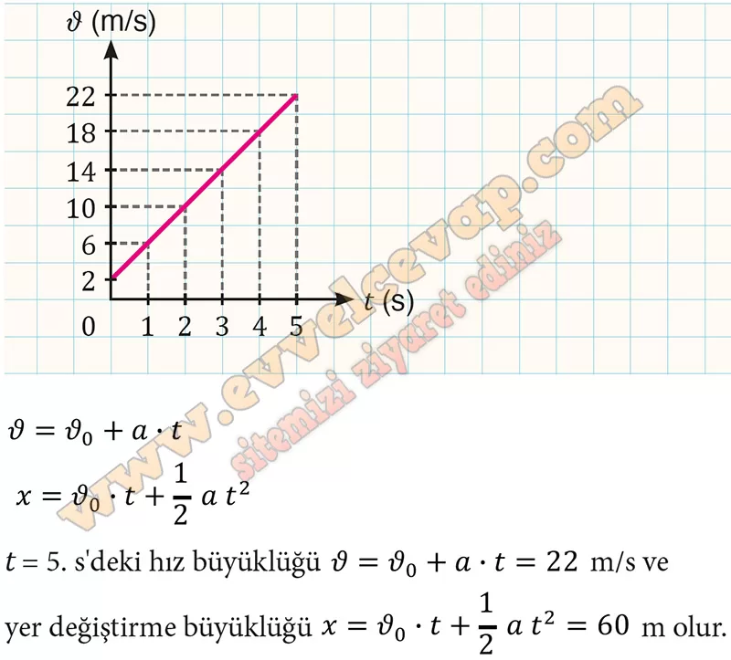

## 10. Sınıf Fizik Ders Kitabı Cevapları Meb Yayınları Sayfa 49

**Soru: 18) Yer değiştirme ve ivme için bulduğunuz matematiksel modelleri kullanarak yer değiştirme ve ivme arasındaki ilişkiyi gösteren bağıntıyı ilgili alana yazınız.**

**Soru: 19) Etkinlikteki işlem basamaklarında bulunan sorulara verdiğiniz cevaplardan yararlanarak çizdiğiniz grafik değerleri ve matematiksel modeller arasındaki ilişkiyi kendi cümleleriniz ile ifade ediniz**

* **Cevap**: Birim zamandaki hız değişimine ivme denir. 𝑥-t grafiğinde grafiğin eğimi ivme büyüklüğünü verir. Sabit ivmeli harekette hız zamanla arttığı için 𝑥-t grafiği parabolik olur. Sabit ivmeli harekette 𝑎-t grafiğinden yararlanarak hız büyüklüğü, c-t grafiğinden yararlanarak yer değiştirme büyüklüğü bulunabilir.

**Değerlendirme**

**Soru: t- 0 anında hızının büyüklüğü 2 m/s olan bir araç, 4 m/s2lik sabit ivmeyle hızlanmaktadır. Aracın â-t grafiğini çizerek hızının ve yer değiştirmesinin matematiksel modelini yazınız. Aracın 5. s’deki hızının ve yer değiştirmesinin büyüklüğünü hesaplayınız.**

**10. Sınıf Meb Yayınları Fizik Ders Kitabı Sayfa 49**