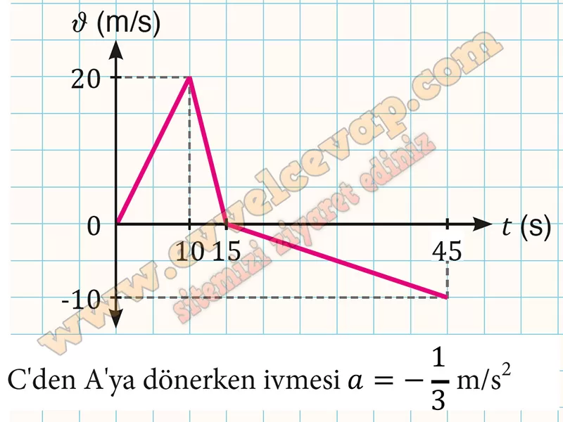

## 10. Sınıf Fizik Ders Kitabı Cevapları Meb Yayınları Sayfa 50

**Soru: 2)** Doğrusal bir yolda A noktasından durgun hâlden harekete başlayan araç, 2 m/s2 ivme büyüklüğü ile 10 s düzgün hızlanarak B noktasına ulaşmıştır. Araç, B noktasında 4 m/s2 ivme büyüklüğü ile düzgün yavaşlayarak C noktasında durmuş ve C noktasından geri dönerek A noktasından 10 m/s hız büyüklüğü ile geçmiştir. **Buna göre aracın ν-t grafiğini çiziniz. Grafikten yararlanarak aracın C noktasından A noktasına hareketi sırasındaki ivmesinin büyüklüğünü hesaplayarak yazınız.**

**10. Sınıf Meb Yayınları Fizik Ders Kitabı Sayfa 50**