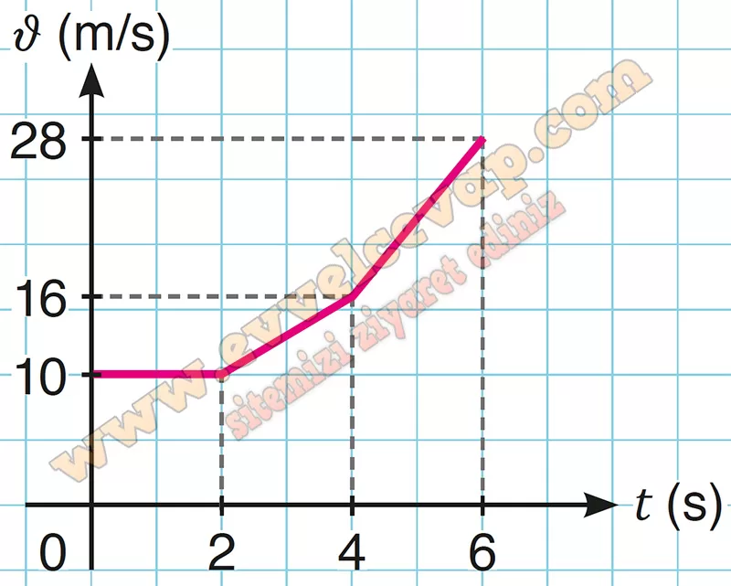

## 10. Sınıf Fizik Ders Kitabı Cevapları Meb Yayınları Sayfa 55

**1.13. Soru**

**Soru: Bir araç, yatay doğrultuda sabit 20 m/s hız büyüklüğü ile yol almaktadır. Sürücü trafikte seyir hâlindey- ken önündeki aracın ani bir şekilde durmasından 0,5 s sonra frene basmaktadır. Aracın yavaşlama ivmesinin büyüklüğü 4 m/s2 olduğuna göre;**

**Soru: a) Durana kadar toplam aldığı yol kaç m olur?**

**Soru: b) Sürücü tepki süresi olmaksızın frene basabilseydi aracın durma mesafesi kaç m olurdu? Hesaplayınız.**

**Soru: c) Hız büyüklüğünün 40 m/s olması durumunda durma mesafesi kaç m olurdu? Hızın durma mesafesine etkisini yorumlayınız.**

* **Cevap**: 𝑥 = 200 m – Hız yüksek ise durma mesafesi çok daha fazla olur.

**1.14. Soru**

**Soru: Yatay doğrultuda sabit ivmeli hareket eden bir cismin grafiği şekildeki gibidir. Başlangıçta cismin hız büyüklüğü 10 m/s olduğuna göre;**

**Soru: a) ν-t grafiğini çiziniz.**

**Soru: b) 6 s’de yaptığı yer değiştirmeyi hesaplayınız.**

**10. Sınıf Meb Yayınları Fizik Ders Kitabı Sayfa 55**