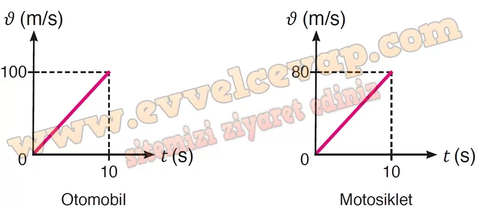

## 10. Sınıf Fizik Ders Kitabı Cevapları Meb Yayınları Sayfa 56

**1.15. Soru**

**Soru:** Kısa sürede yüksek hızlara ulaşan bir araç satın almak isteyen bir sürücü, otomobil ve motosiklet arasında seçim yapmakta zorlanmaktadır. Araç satış noktalarından birindeki satıcı, sürücüye tanıttığı otomobilin 30 m/s sürate ulaşabilmesi için sabit 10 m/s2 büyüklüğünde sabit ivmeyle hareket ettiğini, motosikletin ise 10 s’de 400 m yer değiştirdiğini ifade eder. Satıcı, sürücüye bu büyüklüklerin otomobil ve motosikletin doğrusal bir yol üzerinde durgun hâlden harekete geçerek düzgün hızlanması durumunda geçerli olduğunu belirtir. **Tanıtılan araçlardan birinin diğerine kıyasla daha yüksek hıza ulaştığına karar veren sürücü, bu aracı satın alır. Buna göre;**

**Soru: a) Otomobil ve motosiklet aynı konumdan aynı anda ve aynı yöne doğru durgun halden harekete geçerek düzgün hızlandığında araçların 1. s’de aralarındaki uzaklık kaç m olur?**

**Soru: b) Otomobilin ve motosikletin 10 s’lik zaman dilimine ait hız-zaman grafiklerini çiziniz.**

**Soru: c) Motosikletin ivmesinin büyüklüğü kaç m/s2 dir?**

**Soru: ç) Sürücünün hangi aracı tercih ettiğini düşünüyorsunuz? Gerekçenizi yazınız.**

* **Cevap**: Otomobil ve motosikletin aynı zaman aralığındaki yer değiştirmelerine, ivme büyüklüklerine ve örneğin 10. s’deki hız büyüklüğüne bakıldığında otomobili satın almış olabilir.

**10. Sınıf Meb Yayınları Fizik Ders Kitabı Sayfa 56**