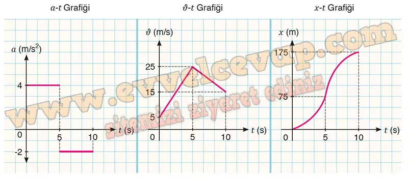

## 10. Sınıf Fizik Ders Kitabı Cevapları Meb Yayınları Sayfa 58

**1.16 Soru**

**Soru: Pozitif yönde hareket eden bir cismin ilk hızının büyüklüğü 5 m/s’dir. Cisim t = O anında 4 m/s2 büyüklüğündeki ivme ile düzgün hızlanarak 5 s, 2 m/s2 büyüklüğündeki ivme ile düzgün yavaşlayarak 5 s ilerlemiştir. Cismin (0-10) s aralığındaki hareketine ait a-t, νJ-t ve x-t grafiklerini aşağıdaki grafik alanına çiziniz.**

**Performans Görevi**

**Adı**: SABİT İVMELİ HAREKET  
 **Beklenen Performans**: Sabit ivmeli hareket ile ilgili bilgi görseli hazırlama ve sunma  
 **Süre**: 30 dk.  
 **Değerlendirme**: Dereceli Puanlama Anahtarı

**Soru: Günlük hayatta karşılaştığınız sabit ivmeli bir hareketi analiz ediniz. Belirlediğiniz hareketin hareket grafiklerinden birini çiziniz. Çizdiğiniz grafiği diğer hareket grafiklerine dönüştürerek grafikten değer bulma ve matematiksel hesaplamalar ile ilgili bir bilgi görseli hazırlayınız. Çalışmanızı günlük hayattan örneklerle destekleyiniz. Hazırladığınız bilgi görsellerini arkadaşlarınıza sununuz.**

**Çalışma sırasında dikkat edilecek hususlar şunlardır:**

**Soru: Konuya ilişkin kavramlar arasındaki bağlantıların bilimsel açıdan uygunluğuna dikkat ediniz.**

**Soru: Yazım ve noktalama kurallarına dikkat ediniz.**

**Soru: Sunumunuzu görseller ve çizimlerle destekleyiniz.**

**Soru: Grafik çizimlerinde eksenlere, birimlere ve ölçeklendirmeye dikkat ediniz.**

**PERFORMANS GÖREVİ SUNUMU**

**Konu:** Sabit İvmeli Hareket

**Günlük Hayattan Örnek:**

Sabit ivmeli harekete örnek olarak kırmızı ışıkta duran bir aracın kalkışını seçtim. Araç, sürücünün gaza basmasıyla harekete geçer ve hızı zamanla düzenli olarak artar. Bu sırada aracın ivmesi sabittir. Bu durum, sabit ivmeli hareketin günlük yaşamdaki en yaygın örneklerinden biridir.

**Hareketin Analizi ve Grafikler:**

Öncelikle aracın **hız-zaman (v-t) grafiğini** çizdim. Bu grafikte hız doğrusal olarak artar ve doğrunun eğimi aracın ivmesini verir. Daha sonra bu grafiği kullanarak **konum-zaman (x-t) grafiğini** elde ettim. Bu grafikte eğri şeklinde artış vardır, çünkü aracın konumu zamanla daha hızlı artar. Son olarak **ivme-zaman (a-t) grafiğini** çizdim. Bu grafikte ivme sabit olduğu için grafik yatay bir doğru şeklindedir.

**Matematiksel Hesaplamalar:**

Hız formülü: v = a × t

Yol formülü: x = ½ × a × t²  
Bu formülleri grafiklerle ilişkilendirerek aracın belirli zaman aralıklarındaki hızını ve aldığı yolu hesapladım. Örneğin, 4 saniyede hızını ve aldığı mesafeyi bu formüllerle bulabildim.

**Görsel Tasarım:**

Bilgi görselimde üç ayrı grafik (x-t, v-t, a-t) yer aldı. Her grafiğin yanına açıklamalar ve örnek hesaplamalar ekledim. Ayrıca günlük hayattan örnekler olarak otobüsün duraktan kalkışı, topun yukarı atılıp geri düşmesi ve bisikletin hızlanması gibi olaylara da yer verdim.

**Sonuç:**

Sabit ivmeli hareket, günlük hayatta sıkça karşılaşılan bir harekettir. Grafikler ve matematiksel hesaplamalar sayesinde bu hareketi daha iyi anlayabiliriz. Hazırladığım bilgi görseliyle arkadaşlarıma hem grafik çizimini hem de günlük hayatla bağlantıyı gösterdim.

**Dikkat Edilecek Hususlar:**

* **Kavramlar:** Hız, ivme ve yer değiştirme ilişkisini doğru kullandım.
* **Yazım:** Noktalama ve yazım kurallarına dikkat ettim.
* **Sunum:** Çizimler, grafikler ve günlük hayat görselleri ile sunumu destekledim.

**10. Sınıf Meb Yayınları Fizik Ders Kitabı Sayfa 58**