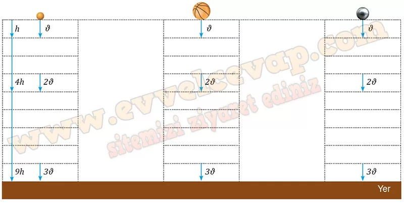

## 10. Sınıf Fizik Ders Kitabı Cevapları Meb Yayınları Sayfa 61

**Soru: 4) Yandaki karekodu kullanarak animasyonu açınız. “BAŞLAT” butonuna tıklayarak farklı kütlelerdeki pinpon topu, basketbol topu ve demir bilyenin hava direnci ihmal edilen bir ortamda aynı yükseklikten ilk hızı sıfır olarak gerçekleştireceği serbest düşme hareketini gözlemleyiniz.**

* **Cevap**: Animasyonu açtık ve “BAŞLAT”a tıklayıp üç cismin serbest düşmesini izledik. Hava direnci ihmal edildiğinde hepsi aynı ivme ile düştüğü için aynı anda yere ulaştığını gözlemledik.

**Soru: 5) Animasyondaki pinpon topu, basketbol topu ve demir bilyenin eşit zaman aralıklarında bulunduğu konumları ve o konumlardan geçerken sahip olduğu hız büyüklüklerini şekildeki topların altındaki boş bırakılan alanlara yazınız. (Şekildeki çizgiler arası mesafeler eşittir.)**

**Soru: 6) Serbest bırakılan cisimlerin ivmelerini, kütle ve boyutları ile ilişkilendirerek düşüncelerinizi arkadaşlarınızla sınıf ortamında eleştirel bir bakış açısıyla tartışınız. Tartışma sırasında kendi fikirlerinizi ve bu fikirlerin destekleyicilerini açıkça belirtiniz, varsa karşıt fikirlere yönelik ifadelerinizi gerekçeleriyle söyleyiniz. Tartışma sonucunda oluşan fikirlerinizi aşağıya yazınız.**

* **Cevap**: Serbest düşme hareketi, cisimlerin kütlelerinden ve boyutlarından bağımsız bir hareket olup cisimlerin üzerine etki eden çekim ivmesine bağlıdır.

**Soru: 7) Yer çekimi ivmesi ile cisimlerin hız değişimi arasındaki ilişkiyi arkadaşlarınızla değerlendirerek vardığınız ortak fikri aşağıya yazınız.**

* **Cevap**: Serbest düşme hareketinde cisimlerin hızları birim zamandaki yer çekimi ivmesi oranında artar.

**Soru: 8) Serbest düşme hareketi yapan cisimlerin ivmesi nelere bağlıdır? Açıklayınız.**

* **Cevap**: Çekim ivmesi, cismin bulunduğu gezegenin veya gök cisminin kütlesine ve yarıçapına bağlıdır. Dünya üzerindeki ortalama yer çekimi ivmesi yaklaşık olarak 9.81 m/s² olarak kabul edilir. Yerin farklı bölgelerinde bu değer küçük değişiklikler gösterebilir.

**Değerlendirme**

**Soru: 1) Düşeyde serbest düşen cisimlerin hareketini açıklayınız.**

* **Cevap**: Serbest düşme hareketi, yer çekimi kuvvetinin etkisi altında gerçekleşen hareketlerin ortak adıdır. Cismin hız büyüklüğü düşeyde her birim zamanda yerin çekim ivmesi ile doğru orantılı olarak değişir.

**10. Sınıf Meb Yayınları Fizik Ders Kitabı Sayfa 61**