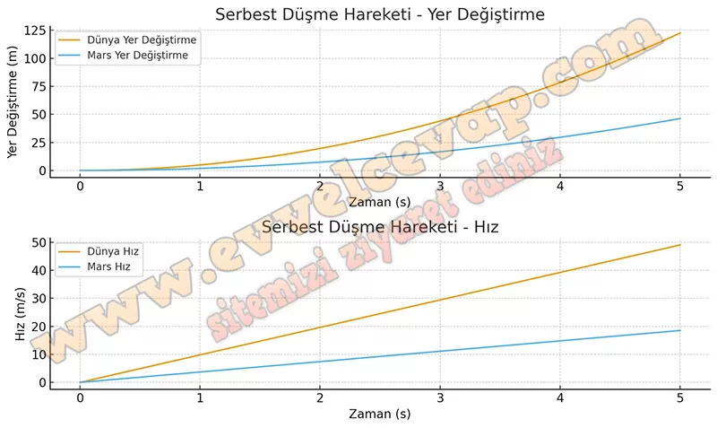

## 10. Sınıf Fizik Ders Kitabı Cevapları Meb Yayınları Sayfa 67

**Performans Görevi**

**Adı**: SERBEST DÜŞME  
 **Beklenen Performans**: Serbest düşme hareketi ile ilgili poster hazırlama  
 **Süre**: 30 dk.  
 **Değerlendirme**: Dereceli Puanlama Anahtarı

**Soru: Dünya ve Mars için verilen çekim ivmesinin büyüklüklerini kullanarak iki farklı gezegende serbest düşme hareketi yapan cisimlerin 5 s’de yaptığı hareketleri A4 kâğıdına hazırlayacağınız poster ile karşılaştırınız. (Dünya ve Mars’ın çekim ivmeleri aşağıdaki tabloda verilmiştir. Hava sürtünmesini ihmal ediniz.)**

**Çalışma sırasında dikkat edilecek hususlar şunlardır:**

**Soru: Poster çiziminde zamanlara karşılık gelen cisimlerin hızlarını ve yer değiştirmelerini doğru yerde belirtiniz.**

**Soru: Posterinizi görsel çizimlerle destekleyiniz.**

**Soru: Çizim yaparken kâğıdınızı estetik açıdan orantılı kullanmaya dikkat ediniz.**

**Soru: Yazım ve noktalama kurallarına dikkat ediniz.**

* **Cevap**: İşte Dünya ve Mars’ta serbest düşme hareketini karşılaştıran poster çizimi: Üstte yer değiştirme, altta hız grafikleri var. Dünya’da cisimler daha hızlı düşerken, Mars’ta daha yavaş düştüğü görülüyor.

**10. Sınıf Meb Yayınları Fizik Ders Kitabı Sayfa 67**