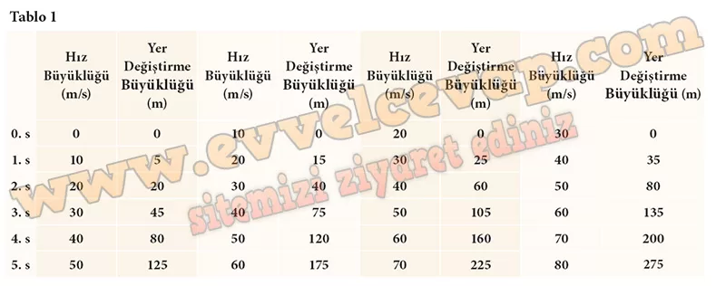
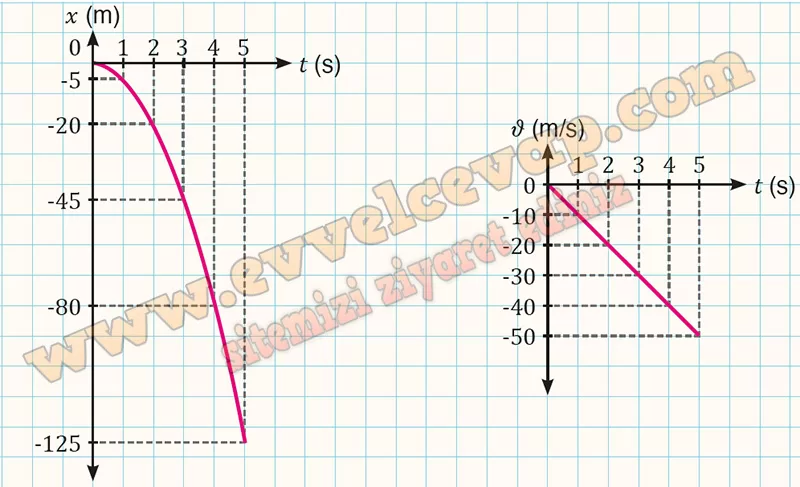

## 10. Sınıf Fizik Ders Kitabı Cevapları Meb Yayınları Sayfa 68

**1.5. Etkinlik**

**Adı**: SERBEST DÜŞME HAREKETİ  
 **Amaç**: Cisimlerin yerin merkezine doğru hareket etmesini sağlayan bir çekim kuvveti olduğunu gözlemleyebilme ve açıklayabilme  
 **Süre**: 35 dk.  
 **Araç**: Gereç Genel ağ bağlantılı cihaz  
 **Yönerge**: Aşağıdaki işlem basamaklarını takip ederek etkinliği gerçekleştiriniz. Etkinlik sonunda değerlendirme sorularını cevaplayınız.

**Soru: 1) Yandaki karekodu kullanarak simülasyonu açınız.**

* **Cevap**: Karekodla simülasyonu açtık.

**Soru: 2) “BAŞLAT” butonuna tıklayarak cismin ilk hızı sıfır olduğundaki hareketini inceleyiniz. Cismin belirlenen zamanlar için hızının ve yer değiştirmesinin büyüklüğünü Tablo 1e yazınız.**

* **Cevap**: “BAŞLAT”a tıklayıp cismin sıfır ilk hızla düşmesini inceledik ve hız ile yer değiştirme değerlerini tabloya yazdık.

**Soru: 3) Sayfanın solundaki “SIFIRLA” butonuna basarak simülasyonu sıfırlayınız.**

* **Cevap**: “SIFIRLA” butonuna basarak simülasyonu yeniden başlattık.

**Soru: 4) Sayfanın solunda yer alan hız butonu ile 10, 20 ve 30 m/s ilk hız değerlerini ayarlayarak simülasyonu tekrarlayınız. Tablo l’de belirtilen zamanlar için cismin hızının ve yer değiştirmesinin büyüklüğünü ilgili yerlere yazınız.**

**Soru: 5) Tablodaki değerlerden yararlanarak ille hızı sıfır olan cisim için x-t ve â-t grafiklerini aşağıdaki alana çiziniz.**

**10. Sınıf Meb Yayınları Fizik Ders Kitabı Sayfa 68**