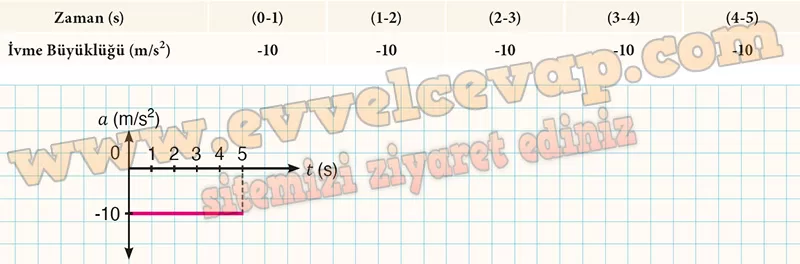

## 10. Sınıf Fizik Ders Kitabı Cevapları Meb Yayınları Sayfa 69

**Soru: 6) Çizdiğiniz ν-t grafiğinden yararlanarak cismin her bir zaman aralığındaki ivmesinin büyüklüğünü bulunuz. Cisme ait bulduğunuz ivme büyüklüğünü Tablo 2 ye yazınız ve grafik alanına a-1 grafiğini çizip yorumlayınız.**

**Soru: 7) Yandaki karekodu kullanarak animasyonu açınız. Animasyondaki ilk hızı sıfırdan farklı olan cismin hareketini inceleyiniz. Cisme ait verileri toplayarak cisim için x-t, û-t ve a-1 grafiklerini aşağıdaki alana çiziniz.**

* **Cevap**: Grafikten elde edilen ivme büyüklüğü ile yer çekimi ivmesinin büyüklüğü birbirine eşittir.

**Soru: 8) Bulduğunuz ivme büyüklüğü ile yer çekimi ivmesinin büyüklüğünü karşılaştırınız, (g = 10 m/s2 alınız.)**

* **Cevap**: Serbest düşme hareketi, yer çekimi kuvvetinin etkisi altında gerçekleşen hareketlerin ortak adıdır. Cisimlerin hız büyüklükleri her bir saniyede yer çekimi ivmesi kadar artar.

**Soru: 9) Elde ettiğiniz grafiklerden ve verilerden yararlanarak serbest düşme hareketini açıklayınız.**

* **Cevap**: Serbest düşmede cisim yalnızca yer çekimi etkisiyle aşağı ivmelenir, hava direnci yok sayılır. İvme sabittir (a=g), hız zamana göre doğrusal artar, konum ise zamanın karesiyle artar.

**Değerlendirme**

**Soru: 1) Serbest düşme hareketine günlük hayattan örnekler veriniz.**

* **Cevap**: Havai fişeklerin gökyüzüne doğru fırlatılması, çocukların olduğu yerde zıplaması vb.

**10. Sınıf Meb Yayınları Fizik Ders Kitabı Sayfa 69**