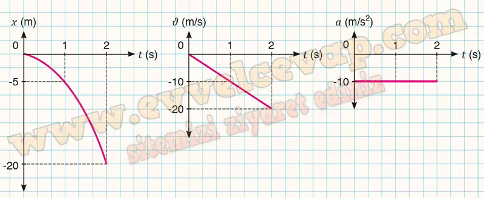

## 10. Sınıf Fizik Ders Kitabı Cevapları Meb Yayınları Sayfa 70

**Soru: 2) Topunu evde unutan Ali, arkadaşı Feryal’e seslenerek onun topunu ödünç ister. Yerden 20 m yükseklikteki katta oturan Feryal, elindeki topu ilk hızı sıfır olacak şekilde serbest bırakır. Buna göre;**

**Soru: a) Top kaç s’de yere çarpar?**

**Soru: b) Topun yere çarpma hızı nedir?**

**Soru: c) Topun x-t, ν-t ve a-t grafiklerini çiziniz.**

**10. Sınıf Meb Yayınları Fizik Ders Kitabı Sayfa 70**