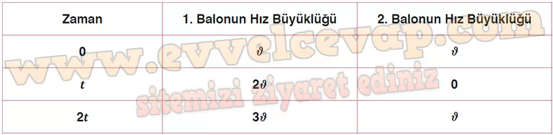

## 10. Sınıf Fizik Ders Kitabı Cevapları Meb Yayınları Sayfa 73

Topun yukarı yönde atılması durumunda takip ettiği yol boyunca hızı ve konumu şekilde gösterilmiştir. Top atıldığı yükseklikten maksimum konuma 1 s’de çıkar. Maksimum yükseklikten 1,1 s sonra yere çarpar. Bu durumda At = 1,1 – 1 =0,1 olduğundan h yüksekliği

Topun yerden yüksekliği, (2-2,1) s zaman aralığında aldığı yola eşittir. Buna göre (2-2,1) s zaman aralığında grafiğin yatay eksenle arasında kalan alan hesaplanarak 1,05 m bulunur.

**1.19 Soru**

**Soru: Öykü ile Berra özdeş su balonlarıyla oynamaktadır. Öykü, balonunu Şekil 1’deki gibi yüksekliğinden d hız büyüklüğü ile düşey aşağı doğru attığı anda Berra da balonunu Şekil 2’deki gibi d ilk hız büyüklüğü ile düşey yukarı doğru fırlatarak balonun h kadar yüksekliğe çıkmasını sağlamaktadır. Her iki balon da 21 süre sonra yere çarpmaktadır. Buna göre;**

**Soru: a) Su balonlarının hız büyüklüklerini hesaplayarak tabloyu doldurunuz.**

**Soru: b) Öykü’nün su balonunu bıraktığı yüksekliği h cinsinden bulunuz.**

**Soru: c) Balonların yere çarptığında patladığı kabul edilirse hangi balon daha fazla su sıçratır? Açıklayınız.**

* **Cevap**: Öykü’nün balonunun yere çarpma hızı fazla olduğundan fırlattığı su miktarı da fazla olacaktır.

**10. Sınıf Meb Yayınları Fizik Ders Kitabı Sayfa 73**