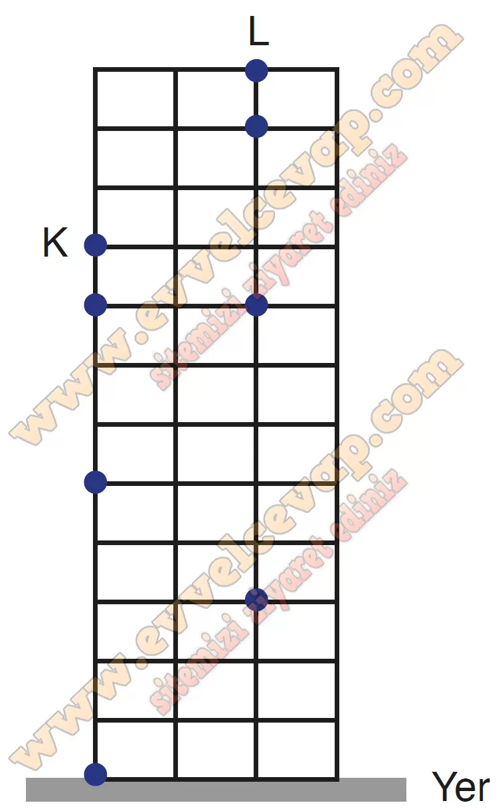

## 10. Sınıf Fizik Ders Kitabı Cevapları Meb Yayınları Sayfa 75

Paraşütçünün 3. s’deki yer değiştirmesini bulabilmek için 3 s’deki yer değiştirmesi ile 2 s’deki yer değiştirmesi hesaplanarak çıkan sonuçların farkı alınır.

**1.20 Soru**

**Soru: Fizik öğretmeni Sezgin Bey, sınıftaki öğrencileri iki gruba ayırarak onlardan havası alınmış ortam içinde serbest düşme hareketi yapan cisimlerle ilgili bir deney yapmalarını ister. Öğretmen tarafından iki gruba ayrılan öğrencilere kütleleri farklı K ve L cisimleri verilmiştir. Buna göre;**

**Soru: a) K ve L cisimleri farklı yüksekliklerden atıldığında grupların deney sonuçlarına göre K ve L cisimlerinin düşey doğrultuda 1, 2 ve 3. s’deki konumlarını verilen şekil üzerinde çizerek gösteriniz.**

**10. Sınıf Meb Yayınları Fizik Ders Kitabı Sayfa 75**