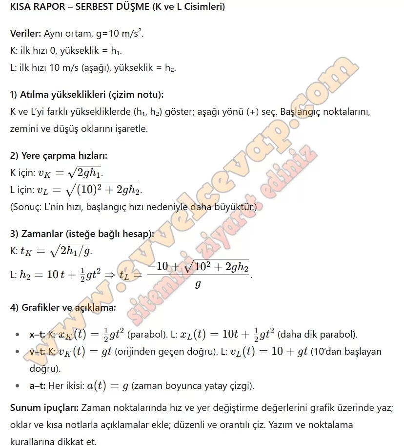

## 10. Sınıf Fizik Ders Kitabı Cevapları Meb Yayınları Sayfa 77

**Performans Görevi**

Adı SERBEST DÜŞME  
 Beklenen Performans: farklı hıza sahip cisimlerin serbest düşme hareketine ait rapor hazırlama  
 Süre: 35 + 40 dk.  
 Değerlendirme: Dereceli Puanlama Anahtarı

**Soru: Aynı çekim ivmesine sahip bir ortamda bulunan K ve L cisimlerinden ilk hızı sıfır olan K cismi hx yüksekliğinden aşağı doğru, ilk hızı sıfırdan farklı olan L cismi h2 yüksekliğinden serbest bırakılmaktadır. L cisminin ilk hızını 10 m/s alarak cisimlerin** • atıldığı yükseklikleri göstereceğiniz,  
 • yere çarpma hızlarını belirleyeceğiniz, **• x-t, ν-t ve a-1 grafiklerini çizerek açıklayacağınız kısa bir rapor hazırlayınız.**

Çalışma sırasında dikkat edilecek hususlar şunlardır:

• Raporunuzda cisimlerin zamanlara karşılık gelen hız ve yer değiştirme büyüklüklerini doğru yerde belirtiniz.  
 • Sınıf içerisinde hazırlayacağınız raporunuzu çizimlerle destekleyiniz.  
 • Çizim yaparken kâğıdınızı estetik açıdan orantılı kullanmaya dikkat ediniz.  
 • Yazım ve noktalama kurallarına dikkat ediniz.

**10. Sınıf Meb Yayınları Fizik Ders Kitabı Sayfa 77**