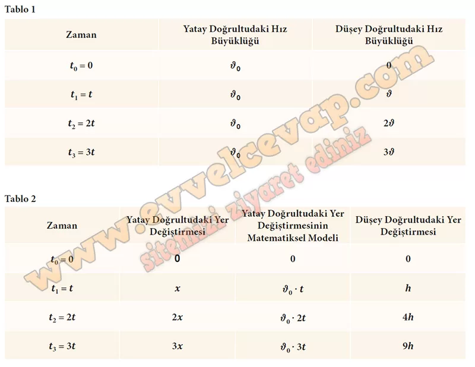

## 10. Sınıf Fizik Ders Kitabı Cevapları Meb Yayınları Sayfa 78

**Konuya Başlarken**

Masa tenisinde rakibe yatay eksen boyunca doğrusal olarak atılan top, fileye takılır ve rakibin yarı sahasına geçemez. Topun, rakibin yarı sahasına ulaşabilmesi için sadece ileriye doğru değil aynı zamanda yukarı doğru bir hareket bileşeninin de olması gerekir. Bu durumda topun rakibin yarı sahasına ulaşabilmesi için hem hız hem de yön önemlidir.

**Soru: Sporcu pinpon topuna rakibinin yarı sahasına değecek şekilde vurduğu andan itibaren topun hızının yatay ve düşey bileşenlerinde zamanla bir değişim meydana gelir mi?**

* **Cevap**: Hava direnci yoksa yatay hız bileşeni sabit kalır, düşey bileşen yer çekimi yüzünden zamanla değişir. Bu yüzden hızın büyüklüğü ve yönü de değişir.

**Soru: Masa tenisinde olduğu gibi futbol veya basketbol maçlarında da sporcuların topa vurma veya topu atma şekli topların gideceği mesafeyi etkiler mi?**

* **Cevap**: Evet; topun gideceği mesafe ilk hızın büyüklüğüne ve atış açısına bağlıdır. Vuruş/atış tekniği bu ikisini değiştirir.

**Soru: Aynı yatay hız büyüklüğü ile denize taş atan farklı boylardaki iki arkadaşın attıkları taşların yatay doğrultuda gideceği mesafe için ne söylenebilir?**

* **Cevap**: Aynı yatay hızla ve yatay atıyorlarsa, daha yüksekte olan taş daha uzun süre düşer ve daha uzağa gider. Yükseklik arttıkça yatay mesafe artar.

**1.6. Etkinlik**

**Adı**: İKİ BOYUTTA SABİT İVMELİ HAREKET  
 **Amaç**: Sabit hızlı ve sabit ivmeli hareket arasındaki ilişkiyi yorumlayabilme  
 **Süre**: 30 + 30 dk.  
 **Araç Gereç**: Genel ağ bağlantılı cihaz  
 **Yönerge**: Aşağıdaki işlem basamaklarını takip ederek etkinliği gerçekleştiriniz. Etkinlik sonunda değerlendirme sorularını cevaplayınız.

**Soru: 1) Öğretmeninizin rehberliğinde 4-6 kişilik gruplar oluşturunuz. Her bir grup için bir temsilci seçiniz.**

* **Cevap**: Öğretmenimizin rehberliğinde 4–6 kişilik grupları oluşturduk ve her grup için bir temsilci seçtik.

**Soru: 2) Yandaki karekodu kullanarak animasyonu açınız. “1. HAREKET” butonuna tıklayınız.**

* **Cevap**: Karekodu okutup animasyonu açtık ve “1. HAREKET” butonuna tıkladık.

**Soru: 3) BAŞLAT” butonuna tıklayarak yerden belidi bir yükseklikte bulunan ve ilk hızı sıfırdan farklı olarak atılan futbol topunun hareketini gözlemleyiniz. Topun yere düşünceye kadar geçen süre için yatay ve düşey doğrultularda sahip olduğu hız büyüklüklerini Tablo 1e, yer değiştirme büyüklüklerini Tablo 2 ye yazınız.**

* **Cevap**: “BAŞLAT”a tıklayıp topun hareketini izledik; yatay hızın sabit, düşey hızın zamanla değiştiğini ölçüp Tablo 1’e yazdık. Yatay ve düşey yer değiştirmeleri de süre boyunca ölçerek Tablo 2’ye kaydettik.

**10. Sınıf Meb Yayınları Fizik Ders Kitabı Sayfa 78**