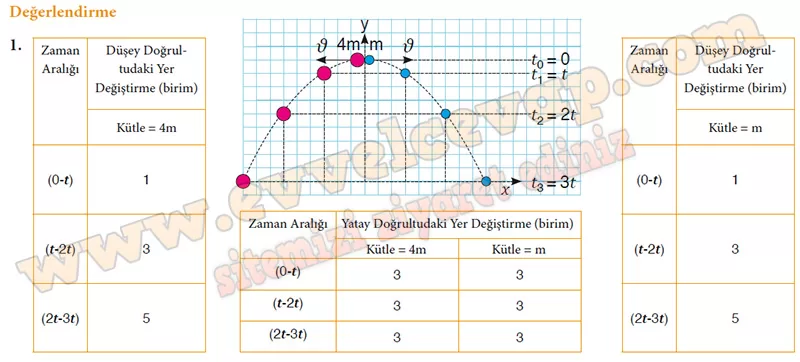

## 10. Sınıf Fizik Ders Kitabı Cevapları Meb Yayınları Sayfa 80

**Soru: 8) İkinci animasyondaki topun yatay ve düşey doğrultularda aynı sürede sahip olduğu hız büyüklüklerinin değişimini Tablo 3’ten yararlanarak karşılaştırınız.**

* **Cevap**: Top yatay doğrultuda sabit hızlı hareket yaparken düşey doğrultuda serbest düşme hareketi yapmaktadır. Topun yatay doğrultudaki hızı sabittir ancak düşey doğrultudaki hızı yer çekimi ivmesine bağlı olarak değişmektedir.

**Soru: 9) İkinci animasyondaki topun aynı zamanda bulunduğu konumları Tablo 4’ten yararlanarak karşılaştırınız.**

* **Cevap**: Top yatay doğrultuda her bir birim zamanda yatay doğrultudaki yer değiştirmeleri eşit olacak şekilde başlangıç noktasından uzaklaşmaktadır. Düşey doğrultuda serbest düşme hareketi yapan topun düşey doğrultudaki yer değiştirmesi yer çekimi ivmesine bağlı olarak zamanla azalmakta ve artmaktadır. Top düşey doğrultuda başlangıç noktasına geri dönmektedir.

**Soru: 10) Her iki animasyondaki topun yatay ve düşey doğrultulardaki hareketini açıklayınız.**

* **Cevap**: Her iki animasyonda da topun, yatay doğrultuda ilk hızın etkisiyle sabit hızla hareket etmekte ve düşey doğrultuda ise yer çekimi kuvvetinin etkisiyle serbest düşme hareketi yapmaktadır.

**Soru: 11) Her iki animasyon için yer çekimi ivmesi ile topların düşey ve yatay doğrultularda ulaştığı hız büyüklüklerindeki değişim arasındaki ilişkiyi yorumlayınız.**

* **Cevap**: Her iki animasyonda da yer çekimi ivmesi, düşey doğrultudaki hız büyüklükleri üzerinde etkili olmuş ancak yatay doğrultudaki hız büyüklükleri üzerinde etkili olmamıştır.

**Soru: 12) Grup olarak topun iki boyutta sabit ivmeli hareketine yönelik iddialarınızı ve iddialarınızın gerekçesini ifade ediniz. Fikirlerinizi grup temsilcisi aracılığıyla sınıfa sunarak varsa diğer grupların karşıt iddialarına yönelik çürütücü fikirlerinizi açıklayınız.**

* **Cevap**: İddiamız: İki boyutta atılan topun yatay hareketi sabit hızlı, düşey hareketi sabit ivmelidir; bu yüzden yol paraboliktir. Gerekçe: Tablo ve grafiklerde vₓ sabit, aₓ=0; vᵧ zamanla değişiyor ve aᵧ=g görülüyor; bu da bağımsız bileşenleri doğrular. Karşı görüşe yanıt: “Yatayda ivme var” denirse vₓ’nin değişmediğini ve sadece düşeyde ivme ölçtüğümüzü gösteririz.

**Soru: 13) İki boyutta sabit ivmeli hareket yapan topların hareketi ile ilgili tartışma sonucunda ulaştığınız genellemeleri yazınız.**

• Top atıldığı andan itibaren yalnızca yer çekimi ivmesinin etkisi altında hareket eder ve düşey doğrultuda sabit ivmeli hareket yapar.  
 • Yatay doğrultuda topa etki edecek bir kuvvet olmadığından topun sahip olduğu hız büyüklüğü değişmez.  
 • Toplar iki boyutlu harekette aynı anda yatay ve düşey doğrultularda yol alır.  
 • Topun her bir birim zamanda yatay doğrultudaki yer değiştirmeleri eşittir.  
 • Topun düşey doğrultuda yer çekimi ivmesi ile hareket ettiğinden topun düşey doğrultudaki yer değiştirmesi  
 yer çekimi ivmesine bağlı olarak zamanla değişir.

**Değerlendirme**

**Soru: 1) Kütleleri farklı iki cisim, hava direncinin ihmal edildiği bir ortamda şekilde gösterildiği gibi herhangi bir yükseklikten aynı hız büyüklükleri ile atılmaktadır. Şekli inceleyerek verilen tabloları doldurunuz. Cisimlerin ivme büyüklüklerinin kütleleri ile ilişkisi üzerine çıkarım yapınız. (Şekilde kareler eşit bölmelendirilmiştir.)**

**10. Sınıf Meb Yayınları Fizik Ders Kitabı Sayfa 80**