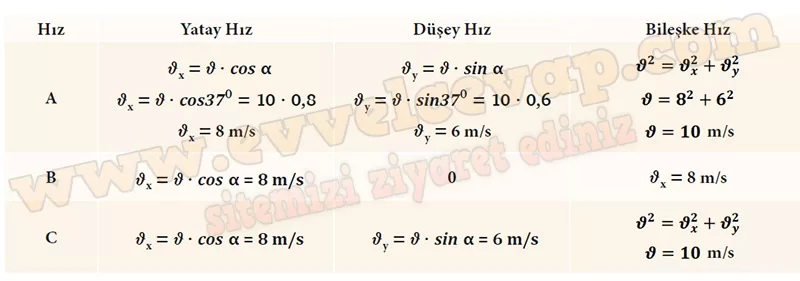

## 10. Sınıf Fizik Ders Kitabı Cevapları Meb Yayınları Sayfa 81

**Soru: 2) Şekil 2, A vektörünün yatay eksenle yaptığı açıya göre vektörün bileşenlerinin matematiksel ifadelerini göstermektedir. Şekil 2deki gibi A vektörü yatay eksenle yaptığı açıya bağlı olarak bileşenlerine ayrıldığına göre Şekil l’de gösterilen topun A, B ve C noktalarındaki yatay ve düşey hız bileşenlerinin büyüklüğü ile bu noktalardaki bileşke hızın büyüklüğünü bularak aşağıdaki tabloyu doldurunuz, (sin 37° = cos 53° = 0,6; sin 53° = cos 37° = 0,8 alınız.)**

**Soru: 3) Boya topu [paintball (peintbol)] oyunu sırasında bir oyuncu, aynı mesafede bulunan iki rakip oyuncuya sırayla atış yapar ancak sadece birini vurabilir. Oyuncunun diğer rakibini vuramama sebebini iki boyutta sabit ivmeli hareket bağlamında açıklayınız. (Oyuncuların boylarını eşit kabul ediniz.)**

• Oyuncu diğer oyuncunun arkasında, eğilmiş veya bir engelin arkasında olabilir.  
 • Hava direnci, topun hızını düşürür ve yörüngesini etkiler.  
 • Oyuncu vuramadığı hedefte farklı atış açısı kullanmıştır.

**10. Sınıf Meb Yayınları Fizik Ders Kitabı Sayfa 81**