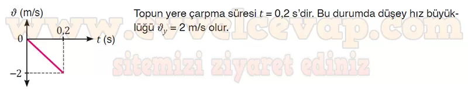
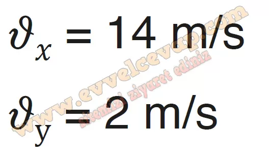

## 10. Sınıf Fizik Ders Kitabı Cevapları Meb Yayınları Sayfa 85

**1.21 Soru**

**Soru: Bir masa tenisi oyunu sırasında yerden 0,20 m yükseklikten geçen topu rakip alana göndermek için topa yatay doğrultuda 14 m/s hız büyüklüğü ile vurulmaktadır. Masayı ortadan ikiye ayıran filenin yüksekliği 14 cm ve masanın uzunluğu 2,80 m’dir. Buna göre;**

**Soru: a) Topun fileyi geçip geçmeme durumunu hesaplayarak yorumlayınız.**

* **Cevap**: Top toplam 0,2 s boyunca düşeyde 0,20 m yol alır. Bu durumda top 1,40 m’ye geldiğinde düşeyde 5 cm yol alarak filenin 1 cm üstünden geçer. Top masanın başlangıç noktasından 2,80 m ileride bulunan karşı kenarına t = 0,2 s’de gelerek çarpar.

**Soru: b) Hızın düşey bileşeninin zamana göre değişim grafiğini çiziniz.**

**Soru: c) Topun rakip alanda masaya çarpma hızının yatay ve düşey bileşeni kaç mis olur?**

**Soru: ç) Topun rakip alana çarpmasına dek geçen süreyi hesaplayınız.**

* **Cevap**: Topun rakip alana çarpma süresi t = 0,2 s’dir.

**10. Sınıf Meb Yayınları Fizik Ders Kitabı Sayfa 85**