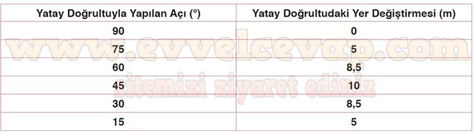

## 10. Sınıf Fizik Ders Kitabı Cevapları Meb Yayınları Sayfa 91

**Örnek**

TÜBİTAK Bilim Şenlikleri kapsamında Uzay ve Havacılık Kulübü öğrencileri tarafından açık alanda tüm güvenlik önlemleri alınarak su roketi yarışması düzenlenmiştir. Yarışmanın amacı, su roketinin en uzağa gitmesini sağlamaktır. Yandaki görsel, yarışmada tasarımcısına birinciliği kazandıran plastik su roketini göstermektedir. Buna göre bir öğrenci su roketini hava sürtünmesinin ihmal edildiği ortamda hangi değişkenleri dikkate alarak tasarlamalıdır?

**Çözüm**

Hava sürtünmesi önemsenmediğinde roketin şeklinin, kanat sayısının ve içindeki su miktarının bir önemi olmaz. Bu durumda fırlatma hızı ve fırlatma açısına dikkat edilerek tasarlanan roket yarışmayı kazanacaktır.

**1.24 Soru**

**Soru: Bir futbolcu tarafından kaleye farklı açılarla altı ayrı şut çekilmiştir. Futbolcu şut çekimlerinde topa aynı büyüklükteki hızla ve aynı yerden vurmaktadır. Topların kalenin önündeki zemine düştüğü noktalar şekilde gösterilmiştir. Buna göre;**

**Soru: a) Futbolcunun her bir atışı arasındaki açının eşit olduğunu göz önünde bulundurarak şekildeki verilerle tabloyu doldurunuz.**

**10. Sınıf Meb Yayınları Fizik Ders Kitabı Sayfa 91**